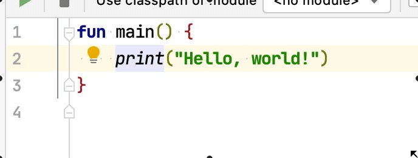
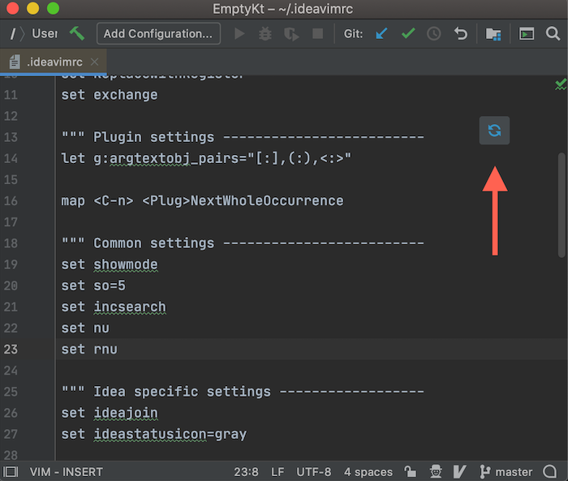

The Changelog
=============

History of changes in IdeaVim for the IntelliJ platform.

The format is based on [Keep a Changelog](https://keepachangelog.com/en/1.0.0/),
and this project adheres to [Semantic Versioning](https://semver.org/spec/v2.0.0.html).

Before version 1.7.0:  
Stable versions use X.Y format.  
EAP ([Early Access Program](https://jb.gg/ideavim-eap)) versions use X.Y.Z format.


Get an Early Access
-------------------

Would you like to try new features and fixes? Join the Early Access Program and
receive EAP builds as updates! Use the `Early Access Program` option in the status bar or
add this URL to "Settings | Plugins | Manage Plugin Repositories":
`https://plugins.jetbrains.com/plugins/eap/ideavim`

It is important to distinguish EAP from traditional pre-release software.
Please note that the quality of EAP versions may at times be way below even
usual beta standards.

## [To Be Released]

### Fixes:
* [VIM-4030](https://youtrack.jetbrains.com/issue/VIM-4030) Fixed `%` motion and block text objects (`va{`, `vi{`) to correctly ignore braces inside string literals
* [VIM-4097](https://youtrack.jetbrains.com/issue/VIM-4097) Fixed `<A-n>` (NextOccurrence) with text containing backslashes - e.g., selecting `\IntegerField` now works correctly
* [VIM-4094](https://youtrack.jetbrains.com/issue/VIM-4094) Fixed UninitializedPropertyAccessException when loading history

## 2.28.0, 2025-12-09

### Features:
* Hints system for component navigation - use hint shortcuts to focus and interact with UI components
* [VIM-4004](https://youtrack.jetbrains.com/issue/VIM-4004) Support for `<F13>` through `<F24>` keys
* [VIM-2143](https://youtrack.jetbrains.com/issue/VIM-2143) Environment variables expansion in `:source`, `:edit`, `:write` and other file commands (e.g., `:source $HOME/.ideavimrc`)
* Command line `<C-R>` commands: insert register (`<C-R>{register}`), word (`<C-R><C-W>`), WORD (`<C-R><C-A>`), line (`<C-R><C-L>`), filename (`<C-R><C-F>`)
* New VimScript functions: `count()`, `index()`, `min()`, `max()`, `range()`, `repeat()`, `char2nr()`, `nr2char()`, `trim()`, `reverse()`, `getline()`, `deepcopy()`, `copy()`, `string()`
* Support for `let` command value unpacking (e.g., `let [a, b] = [1, 2]`)
* Support for environment variables in Vim expressions (e.g., `echo $HOME`)
* Support for recursive values in Vim datatypes

### Fixes:
* [VIM-4072](https://youtrack.jetbrains.com/issue/VIM-4072) Fixed error log when sourcing non-existent file
* [VIM-4073](https://youtrack.jetbrains.com/issue/VIM-4073) Fixed cursor position with inlay hints during `f`/`t` motions
* [VIM-3981](https://youtrack.jetbrains.com/issue/VIM-3981) Fixed `:set noNERDTree` command
* [VIM-4028](https://youtrack.jetbrains.com/issue/VIM-4028) Fixed plugin registration error that caused exceptions on startup
* Fixed `vmap` to correctly apply to both visual and select modes
* Fixed expression parser precedence issues for ternary and falsy operators

### Changes:
* Minimum supported IntelliJ platform version is now 2025.3

### Merged PRs:
* [1385](https://github.com/JetBrains/ideavim/pull/1385) by [Matt Ellis](https://github.com/citizenmatt): Implement unpacking of values in a let command
* [1384](https://github.com/JetBrains/ideavim/pull/1384) by [Matt Ellis](https://github.com/citizenmatt): Evaluate environment variables as part of a Vim expression
* [1383](https://github.com/JetBrains/ideavim/pull/1383) by [Matt Ellis](https://github.com/citizenmatt): Support recursive values in Vim datatypes
* [1373](https://github.com/JetBrains/ideavim/pull/1373) by [Matt Ellis](https://github.com/citizenmatt): Fix some precedence issues in the expression parser

---

**Changelog was not maintained for versions 2.10.0 through 2.27.0**

---

## 2.9.0, 2024-02-20

### Fixes:
* [VIM-3055](https://youtrack.jetbrains.com/issue/VIM-3055) Fix the issue with double deleting after dot

### Merged PRs:
* [805](https://github.com/JetBrains/ideavim/pull/805) by [chylex](https://github.com/chylex): VIM-3238 Fix recording a macro that replays another macro

## 2.8.0, 2024-01-30

### Fixes:
* [VIM-3130](https://youtrack.jetbrains.com/issue/VIM-3130) Change the build version to 2023.1.2
* [VIM-3168](https://youtrack.jetbrains.com/issue/VIM-3168) Do not switch to block caret after enter if the IdeaVim is disabled
* [VIM-3165](https://youtrack.jetbrains.com/issue/VIM-3165) Do not process enter key as IdeaVim shortcut if it's not an actual keypress
* [VIM-3159](https://youtrack.jetbrains.com/issue/VIM-3159) Shift-enter now works in normal mode again
* [VIM-3157](https://youtrack.jetbrains.com/issue/VIM-3157) Do not invoke enter in invokeLater for python console
* [VIM-3195](https://youtrack.jetbrains.com/issue/VIM-3195) Fix escape in injected editor
* [VIM-3190](https://youtrack.jetbrains.com/issue/VIM-3190) Do not use octopus handler if the enter key is used with modifiers like shift or control
* [VIM-3203](https://youtrack.jetbrains.com/issue/VIM-3203) Split action not works in normal mode
* [VIM-3184](https://youtrack.jetbrains.com/issue/VIM-3184) Revert "VIM-3184: Temporally disable new handlers for the thin client"
* [VIM-3186](https://youtrack.jetbrains.com/issue/VIM-3186) Do not multiply the enter action by the amount of carets
* [VIM-3177](https://youtrack.jetbrains.com/issue/VIM-3177) Formatting of commit message works again
* [VIM-1611](https://youtrack.jetbrains.com/issue/VIM-1611) actions related to resolving conflicts doesn't seem to work
* [VIM-3204](https://youtrack.jetbrains.com/issue/VIM-3204) Add checker that verifies the configuratin of the keymap
* [VIM-3084](https://youtrack.jetbrains.com/issue/VIM-3084) Double update for the status bar icon
* [VIM-3176](https://youtrack.jetbrains.com/issue/VIM-3176) Reselecting visual selection after pasting above it select wrong lines
* [VIM-3206](https://youtrack.jetbrains.com/issue/VIM-3206) Disable both copilot suggestion and insert mode on a single escape
* [VIM-3090](https://youtrack.jetbrains.com/issue/VIM-3090) Cmd line mode saves the visual mode
* [VIM-3085](https://youtrack.jetbrains.com/issue/VIM-3085) Open access to VimTypedActionHandler and VimShortcutKeyAction
* [VIM-3260](https://youtrack.jetbrains.com/issue/VIM-3260) Processing the offsets at the file end
* [VIM-3183](https://youtrack.jetbrains.com/issue/VIM-3183) Execute .ideavimrc on pooled thread

### Merged PRs:
* [763](https://github.com/JetBrains/ideavim/pull/763) by [Sam Ng](https://github.com/samabcde): Fix(VIM-3176) add test for restore selection after pasting in/below s…
* [772](https://github.com/JetBrains/ideavim/pull/772) by [chylex](https://github.com/chylex): Prevent code completion popup from appearing after running a macro
* [787](https://github.com/JetBrains/ideavim/pull/787) by [Leonid Danilov](https://github.com/Infonautica): Added "Which-Key" to Plugins
* [778](https://github.com/JetBrains/ideavim/pull/778) by [lippfi](https://github.com/lippfi): Showmode
* [788](https://github.com/JetBrains/ideavim/pull/788) by [Matt Ellis](https://github.com/citizenmatt): Refactor VimOptionGroupBase

## 2.7.0, 2023-11-07

### Fixes:
* [VIM-2933](https://youtrack.jetbrains.com/issue/VIM-2933) Reloading/sourcing .ideavimrc does not initialize new plugins
* [VIM-3138](https://youtrack.jetbrains.com/issue/VIM-3138) Do not try to register disposer if the caret is already disposed

### Merged PRs:
* [734](https://github.com/JetBrains/ideavim/pull/734) by [Matt Ellis](https://github.com/citizenmatt): Support `~/` on Windows
* [736](https://github.com/JetBrains/ideavim/pull/736) by [chylex](https://github.com/chylex): Fix(VIM-2933): Reloading/sourcing .ideavimrc does not initialize new plugins

## 2.6.3, 2023-10-30

### Changes:
- 2.6.0 and 2.6.1 releases are broken. Version 2.6.3 reverts IdeaVim plugin to the working state as for 2.5.1.

## 2.6.0, 2023-10-27

This version of IdeaVim contains a lot of issues. Version 2.6.3 reverts these changes.

### Features:

* `ShowHoverInfo` action can be used in mappings to open a tooltip that is shown by
  mouse hovering | [VIM-2106](https://youtrack.jetbrains.com/issue/VIM-2106)
* `has` Vim Script function supports the most common OS checks: win32, win64, linux, mac, macunix, osx, osxdarwin, bsd, sun, unix
  * See https://github.com/JetBrains/ideavim#vim-script for details about Vim Script

### Fixes:
* [VIM-3060](https://youtrack.jetbrains.com/issue/VIM-3060) Clipboard interaction stopped working
* [VIM-3095](https://youtrack.jetbrains.com/issue/VIM-3095) Fix missing ellipsis digraph
* [VIM-2562](https://youtrack.jetbrains.com/issue/VIM-2562) Fix hang with multi-width chars in command line
* [VIM-696](https://youtrack.jetbrains.com/issue/VIM-696) Vim selection issue after undo
* [VIM-1639](https://youtrack.jetbrains.com/issue/VIM-1639) Ctrl-o and Ctrl-i jumping in files of different projects

### Merged PRs:
* [697](https://github.com/JetBrains/ideavim/pull/697) by [Matt Ellis](https://github.com/citizenmatt): Support per-window "global" values for local-to-window options
* [717](https://github.com/JetBrains/ideavim/pull/717) by [Matt Ellis](https://github.com/citizenmatt): Fix(VIM-2562): Fix hang with multi-width chars in command line
* [732](https://github.com/JetBrains/ideavim/pull/732) by [pWydmuch](https://github.com/pWydmuch): Fix md links in doc
* [733](https://github.com/JetBrains/ideavim/pull/733) by [Matt Ellis](https://github.com/citizenmatt): Add support for ShowHoverInfo action to 2023.1 and 2023.2
* [729](https://github.com/JetBrains/ideavim/pull/729) by [chylex](https://github.com/chylex): Add operating system type to `has()` function
* [726](https://github.com/JetBrains/ideavim/pull/726) by [Matt Ellis](https://github.com/citizenmatt): Fix range for fall back comment mode

## 2.5.0, 2023-09-01

### Fixes:
* [VIM-802](https://youtrack.jetbrains.com/issue/VIM-802) IdeaVim vs. Vim: discrepancies in using registers
* [VIM-2246](https://youtrack.jetbrains.com/issue/VIM-2246) X11/Xorg Primary selection register "* not supported
* [VIM-2313](https://youtrack.jetbrains.com/issue/VIM-2313)
  [VIM-2318](https://youtrack.jetbrains.com/issue/VIM-2318)
  [VIM-2666](https://youtrack.jetbrains.com/issue/VIM-2666)
  [VIM-2951](https://youtrack.jetbrains.com/issue/VIM-2951)
  IdeaVim works correctly in read-only editors like log or tests output.

### Merged PRs:
* [666](https://github.com/JetBrains/ideavim/pull/666) by [Matt Ellis](https://github.com/citizenmatt): Improve formatting of `:set` command output
* [667](https://github.com/JetBrains/ideavim/pull/667) by [Matt Ellis](https://github.com/citizenmatt): Eagerly initialise local options and introduce option scope
* [672](https://github.com/JetBrains/ideavim/pull/672) by [Matt Ellis](https://github.com/citizenmatt): Fix issue adding back hidden status bar widget
* [668](https://github.com/JetBrains/ideavim/pull/668) by [ludwig-jb](https://github.com/ludwig-jb): Handle unicode grapheme clusters

## 2.4.0, 2023-07-18

### Fixes:
* [VIM-2975](https://youtrack.jetbrains.com/issue/VIM-2975) Fix the offset after the rendered docs
* [VIM-2685](https://youtrack.jetbrains.com/issue/VIM-2685) Register command outputs different values for same registers
* [VIM-1294](https://youtrack.jetbrains.com/issue/VIM-1294) unvoluntary unfolding when using ideavim
* [VIM-2818](https://youtrack.jetbrains.com/issue/VIM-2818) Wrong caret position after multicaret paste

### Merged PRs:
* [662](https://github.com/JetBrains/ideavim/pull/662) by [ludwig-jb](https://github.com/ludwig-jb): Update VimMessages#updateStatusBar to accept VimEditor
* [659](https://github.com/JetBrains/ideavim/pull/659) by [Sam Ng](https://github.com/samabcde): VIM-2920 fix select block expansion when enclose boundary is line break

## 2.3.0, 2023-06-14

### Features:
* Matchit now supports PHP files | [VIM-2678](https://youtrack.jetbrains.com/issue/VIM-2678)

### Fixes:
* [VIM-2909](https://youtrack.jetbrains.com/issue/VIM-2909) Fix incorrect file detection while closing diff window
* [VIM-2912](https://youtrack.jetbrains.com/issue/VIM-2912) Fix focus after :q
* [VIM-2930](https://youtrack.jetbrains.com/issue/VIM-2930) vim-multiple-cursors + ReplaceWithRegister issue
* [VIM-2945](https://youtrack.jetbrains.com/issue/VIM-2945) %-movement mismatches braces
* [VIM-2953](https://youtrack.jetbrains.com/issue/VIM-2953) The previous fix for :q command caused weird behavior of tab closing
* [VIM-2964](https://youtrack.jetbrains.com/issue/VIM-2964) Fix an issue with leaking caret instance

### Merged PRs:
* [616](https://github.com/JetBrains/ideavim/pull/616) by [Matt Ellis](https://github.com/citizenmatt): Refactor/option delegated properties
* [626](https://github.com/JetBrains/ideavim/pull/626) by [Martin Yzeiri](https://github.com/myzeiri): Matchit bug fixes
* [619](https://github.com/JetBrains/ideavim/pull/619) by [Matt Ellis](https://github.com/citizenmatt): Fix some local options being used as global options
* [638](https://github.com/JetBrains/ideavim/pull/638) by [Sam Ng](https://github.com/samabcde): VIM-2615 add support to sort u command
* [646](https://github.com/JetBrains/ideavim/pull/646) by [Sam Ng](https://github.com/samabcde): VIM-1990 fix repeat delete find or till wrong MotionType
* [649](https://github.com/JetBrains/ideavim/pull/649) by [Martin Yzeiri](https://github.com/myzeiri): Add Matchit support for PHP 

## 2.2.0, 2023-04-20

### Features:
* Now every secondary caret has its own marks. You can use marks and `gv` in multiple-caret mode now.

### Fixes:
* [VIM-1829](https://youtrack.jetbrains.com/issue/VIM-1829/key-combinations-are-not-working-in-visual-mode-IdeaVim) Fix marks when moving lines up/down
* [VIM-2130](https://youtrack.jetbrains.com/issue/VIM-2130/Vim-visual-mode-mapping-isnt-behaving-correctly-in-ideavim-it-leaves-visual-mode-after-its-executed) Fix marks when moving lines up/down
* [VIM-2428](https://youtrack.jetbrains.com/issue/VIM-2428/The-gv-command-doesnt-work) Fix marks when moving lines up/down
* [VIM-2686](https://youtrack.jetbrains.com/issue/VIM-2686/Multiple-caret-marks) Add individual mark storage for each secondary caret
* [VIM-2840](https://youtrack.jetbrains.com/issue/VIM-2840) Replace with register does not work with count
* [VIM-658](https://youtrack.jetbrains.com/issue/VIM-658) Stop macro on error
* [VIM-2787](https://youtrack.jetbrains.com/issue/VIM-2787) Save ideavimrc loading
* [VIM-2850](https://youtrack.jetbrains.com/issue/VIM-2850) Marks exception during IDE startup 
* [VIM-2804](https://youtrack.jetbrains.com/issue/VIM-2804) IdeaVim multiple-cursors copy and paste issue when "set clipboard+=unnamed"
* [VIM-1768](https://youtrack.jetbrains.com/issue/VIM-1768) Delete surrounding character while in multiple cursors mode
* [VIM-282](https://youtrack.jetbrains.com/issue/VIM-282) Cursor line wrapping support (whichwrap)
* [VIM-2315](https://youtrack.jetbrains.com/issue/VIM-2315) Fix overlapping mappings execution
* [VIM-44](https://youtrack.jetbrains.com/issue/VIM-44) Unify navigation history between ideavim and idea
* [VIM-1735](https://youtrack.jetbrains.com/issue/VIM-1735) Fix enabling mulple carets after line selection
* [VIM-2881](https://youtrack.jetbrains.com/issue/VIM-2881) ReplaceRegister does no longer worker with MultiCursor
* [VIM-2244](https://youtrack.jetbrains.com/issue/VIM-2244) nnoremap mapping doesn't work correctly
* [VIM-2885](https://youtrack.jetbrains.com/issue/VIM-2885) "v:searchforward" does't work for IdeaVim
* [VIM-2733](https://youtrack.jetbrains.com/issue/VIM-2733) vim-surround emulation interacts incorrectly with unmatched quotes on previous lines
* [VIM-2884](https://youtrack.jetbrains.com/issue/VIM-2884) Moving multiple lines in visual mode is not working
* [VIM-2868](https://youtrack.jetbrains.com/issue/VIM-2868) Pasting in visual mode with P should not replace yank register like when pasting with p
* [VIM-2819](https://youtrack.jetbrains.com/issue/VIM-2819) Move command works incorrectly
* [VIM-795](https://youtrack.jetbrains.com/issue/VIM-795) Ctrl-w + h doesn't alway work (window navigation to the left window)
* [VIM-1551](https://youtrack.jetbrains.com/issue/VIM-1551) Surround: line surround not working
* [VIM-1746](https://youtrack.jetbrains.com/issue/VIM-1746) IdeaVim Surround removes unwanted characters
* [VIM-1750](https://youtrack.jetbrains.com/issue/VIM-1750) Surround with tag wrong position
* [VIM-2286](https://youtrack.jetbrains.com/issue/VIM-2286) Set surround not working for me as expected
* [VIM-2433](https://youtrack.jetbrains.com/issue/VIM-2433) Do not clear clipboard after inserting with ideaput
* [VIM-2896](https://youtrack.jetbrains.com/issue/VIM-2896) Correct ordering of handlers
* [VIM-2912](https://youtrack.jetbrains.com/issue/VIM-2912) Fix focus after :q
* [VIM-2909](https://youtrack.jetbrains.com/issue/VIM-2909) Fix incorrect file detection while closing diff window

### Merged PRs:
* [589](https://github.com/JetBrains/ideavim/pull/589) by [Matt Ellis](https://github.com/citizenmatt): Refactor option usage and introduce accessor API
* [604](https://github.com/JetBrains/ideavim/pull/604) by [Dominic Palmer](https://github.com/dominicpalmer): VIM-2773: Include empty lines in the selection when dragging backwards from EOL
* [603](https://github.com/JetBrains/ideavim/pull/603) by [Dominic Palmer](https://github.com/dominicpalmer): VIM-2773: Prevent viewport displacement on undo
* [602](https://github.com/JetBrains/ideavim/pull/602) by [Matt Ellis](https://github.com/citizenmatt): Refactor options service
* [612](https://github.com/JetBrains/ideavim/pull/612) by [Dani Sevastianov](https://github.com/danisevas): Fix quick-scope setup documentation
* [617](https://github.com/JetBrains/ideavim/pull/617) by [Silence Tai](https://github.com/Stzx): Fix dispose operation

## 2.1.0, 2023-01-10

### Features:
* Add IdeaVim tutor. You can access it via the status bar icon.

### Fixes:
* [VIM-2797](https://youtrack.jetbrains.com/issue/VIM-2797) Introduce variable to mute default argtextobj mappings
* [VIM-758](https://youtrack.jetbrains.com/issue/VIM-758) Support d mappings
* [VIM-2577](https://youtrack.jetbrains.com/issue/VIM-2577) Fix paste at the end of notebook cell
* [VIM-2813](https://youtrack.jetbrains.com/issue/VIM-2813) Migrate update checker to VimStandalonePluginUpdateChecker
* [VIM-2833](https://youtrack.jetbrains.com/issue/VIM-2833) Fix rare deadlock during put in insert mode from clipboard

### Merged PRs:
* [558](https://github.com/JetBrains/ideavim/pull/558) by [Matt Ellis](https://github.com/citizenmatt): Fix incorrect normalising for trailing inlay
* [554](https://github.com/JetBrains/ideavim/pull/554) by [Matt Ellis](https://github.com/citizenmatt): Refactor "last column" calculations
* [553](https://github.com/JetBrains/ideavim/pull/553) by [Matt Ellis](https://github.com/citizenmatt): Rearrange and rename some code in engine
* [560](https://github.com/JetBrains/ideavim/pull/560) by [Runinho](https://github.com/Runinho): Fix(VIM-2577) paste not working at end of notebook cell
* [571](https://github.com/JetBrains/ideavim/pull/571) by [Ada](https://github.com/adaext): Remove the redundant quotation mark at the end of "packadd matchit" command
* [561](https://github.com/JetBrains/ideavim/pull/561) by [Matt Ellis](https://github.com/citizenmatt): Fix incremental search not scrolling to current match
* [559](https://github.com/JetBrains/ideavim/pull/559) by [Runinho](https://github.com/Runinho): Fix(VIM-2760) notebookCommandMode detection
* [579](https://github.com/JetBrains/ideavim/pull/579) by [Martin Yzeiri](https://github.com/myzeiri): VIM-2799: Add Matchit support for cshtml files
* [580](https://github.com/JetBrains/ideavim/pull/580) by [Martin Yzeiri](https://github.com/myzeiri): Matchit: Add more Rider file types
* [583](https://github.com/JetBrains/ideavim/pull/583) by [Matt Ellis](https://github.com/citizenmatt): Introduce ScrollGroup
* [586](https://github.com/JetBrains/ideavim/pull/586) by [Patrick Elmquist](https://github.com/patrick-elmquist): Fixed number references in Tutor

## 2.0.0, 2022-11-01

### Changes:
* IdeaVim changes license from GPL-2.0 or later to MIT. [VIM-2782](https://youtrack.jetbrains.com/issue/VIM-2782)

## 1.12.0, 2022-11-01

### Fixes:
* [VIM-1758](https://youtrack.jetbrains.com/issue/VIM-1758) Commentary plugin in rider
* [VIM-1903](https://youtrack.jetbrains.com/issue/VIM-1903) Autoindent now works in rider
* [VIM-2744](https://youtrack.jetbrains.com/issue/VIM-2744) Fix undo from ex line
* [VIM-2749](https://youtrack.jetbrains.com/issue/VIM-2749) Fix :tabn and :tabN commands
* [VIM-2718](https://youtrack.jetbrains.com/issue/VIM-2718) Fixed case where the primary caret was changed
* [VIM-2766](https://youtrack.jetbrains.com/issue/VIM-2766) Move NERDTree update to background thread
* [VIM-2768](https://youtrack.jetbrains.com/issue/VIM-2768) Refactor listeners
* [VIM-2776](https://youtrack.jetbrains.com/issue/VIM-2776) Use filename index for file search

### Merged PRs:
* [550](https://github.com/JetBrains/ideavim/pull/550) by [Matt Ellis](https://github.com/citizenmatt): Fix(VIM-2778) Remove override of editor scroll setting

## 1.11.0, 2022-08-09

### Features:
* Add `gcu` command for Commentary plugin
* Add `:Commentary` command, which works great for commands such as `:%g/fun/Commentary`
* Support `gc` – commentary text objects. E.g. `dgc`: delete commented text.
* Support `redo-register feature` | [VIM-2643](https://youtrack.jetbrains.com/issue/VIM-2643/Dot-operator-doesn-t-increment-number-register-after-pasting-fro) | [viminfo](http://vimdoc.sourceforge.net/htmldoc/undo.html#redo-register)

### Changes:
* Uses the same mappings as Commentary, so custom bindings for the Vim plugin will work with IdeaVim, too.
  E.g. `<Plug>Commentary` instead of `<Plug>(CommentMotion)`. Old mappings are maintained for compatibility.
* If you open `~/.ideavimrc` in IDE, remove a mapping, and reload the config using the reload button,
  the mapping will actually be unmapped.
* New vim (and IdeaVim) behaviour: `ci(`& friends searches for the brackets in the line.

### Fixes:
* [VIM-2587](https://youtrack.jetbrains.com/issue/VIM-2587) Use ctrl-6 as ctrl-^
* [VIM-2590](https://youtrack.jetbrains.com/issue/VIM-2590) Fix caret shape in PyCharm
* [VIM-2553](https://youtrack.jetbrains.com/issue/VIM-2553) Substitute consecutive matches
* [VIM-1687](https://youtrack.jetbrains.com/issue/VIM-1687) Support count for `gcc`
* [VIM-2381](https://youtrack.jetbrains.com/issue/VIM-2381) Fall back to line comment if block comment is not available
* [VIM-2589](https://youtrack.jetbrains.com/issue/VIM-2589) Add `gc` text object
* [VIM-2604](https://youtrack.jetbrains.com/issue/VIM-2604) Update action execution rules
* [VIM-2654](https://youtrack.jetbrains.com/issue/VIM-2654) Add support for `return` without expression
* [VIM-2630](https://youtrack.jetbrains.com/issue/VIM-2630/Please-fix-warning-Shall-not-be-called-on-a-template-presentatio) Fix IDE freeze
* [VIM-2661](https://youtrack.jetbrains.com/issue/VIM-2661/Spamming-does-not-work) Fix repeating the `@@` command
* [VIM-2668](https://youtrack.jetbrains.com/issue/VIM-2668/tabm-or-tabm-with-no-number-does-not-match-vim-behavior) Fix omitted numbers in `tabm` command
* [VIM-2595](https://youtrack.jetbrains.com/issue/VIM-2595) Support plugins in macro execution
* [VIM-2671](https://youtrack.jetbrains.com/issue/VIM-2671) Fix using plugins from mappings
* [VIM-2675](https://youtrack.jetbrains.com/issue/VIM-2675) Fix numbering register in visual mode
* [VIM-744](https://youtrack.jetbrains.com/issue/VIM-744/Use-undoredo-with-count-modifier) Add count to undo/redo
* [VIM-1862](https://youtrack.jetbrains.com/issue/VIM-1862/Ex-commands-executed-in-keymaps-and-macros-are-added-to-the-command-history) Fix command history
* [VIM-2227](https://youtrack.jetbrains.com/issue/VIM-2227) Wrong behavior when deleting / changing surround with invalid character
* [VIM-2691](https://youtrack.jetbrains.com/issue/VIM-2691) Save file on :w
* [VIM-2710](https://youtrack.jetbrains.com/issue/VIM-2710) Show options value on `set opt`
* [VIM-913](https://youtrack.jetbrains.com/issue/VIM-913) Partially fix the issue with macros and autocompletion
* [VIM-2723](https://youtrack.jetbrains.com/issue/VIM-2723) Move focus to editor after :q
* [VIM-2728](https://youtrack.jetbrains.com/issue/VIM-2728) Give access to global variables

### Merged PRs:
* [468](https://github.com/JetBrains/ideavim/pull/468) by [Thomas Schouten](https://github.com/PHPirates): Implement UserDataHolder for EditorDataContext
* [483](https://github.com/JetBrains/ideavim/pull/483) by [Simon Rainer](https://github.com/Vvalter): Fix(VIM-2553): Substitute consecutive matches
* [488](https://github.com/JetBrains/ideavim/pull/488) by [Martin Yzeiri](https://github.com/myzeiri): Add Matchit support for the C family of languages
* [493](https://github.com/JetBrains/ideavim/pull/493) by [Matt Ellis](https://github.com/citizenmatt): Improvements to Commentary extension
* [494](https://github.com/JetBrains/ideavim/pull/494) by [Matt Ellis](https://github.com/citizenmatt): Cleanup pre-212 CaretVisualAttributes compatibility code
* [504](https://github.com/JetBrains/ideavim/pull/504) by [Matt Ellis](https://github.com/citizenmatt): Minor bug fixes
* [519](https://github.com/JetBrains/ideavim/pull/519) by [chylex](https://github.com/chylex): Fix(VIM-2227): Wrong behavior when deleting / changing surround with invalid character
* [525](https://github.com/JetBrains/ideavim/pull/525) by [Matt Ellis](https://github.com/citizenmatt): Improve handling of fractional width fonts
* [526](https://github.com/JetBrains/ideavim/pull/526) by [Alex Pláte](https://github.com/AlexPl292): Create gradle.properties
* [528](https://github.com/JetBrains/ideavim/pull/528) by [chylex](https://github.com/chylex): Implement partial code completion support in macros
* [531](https://github.com/JetBrains/ideavim/pull/531) by [Matt Ellis](https://github.com/citizenmatt): Consolidate doTest methods

## 1.10.0, 2022-02-17

### Features:
* Add register support to let command | [VIM-749](https://youtrack.jetbrains.com/issue/VIM-749), [VIM-1783](https://youtrack.jetbrains.com/issue/VIM-1783)
* Add tabmove command | [VIM-1164](https://youtrack.jetbrains.com/issue/VIM-1164)

### Fixes:
* [VIM-2502](https://youtrack.jetbrains.com/issue/VIM-2502) Fix the shape of new carets
* [VIM-2499](https://youtrack.jetbrains.com/issue/VIM-2499) Fix mapping to esc
* [VIM-2500](https://youtrack.jetbrains.com/issue/VIM-2500) Fix esc for normal mode
* [VIM-2523](https://youtrack.jetbrains.com/issue/VIM-2523) `i` command for the folder in the project tree
* [VIM-2471](https://youtrack.jetbrains.com/issue/VIM-2471) Multiple [{ and ]} actions
* [VIM-2504](https://youtrack.jetbrains.com/issue/VIM-2504) Fix esc with using python notebooks
* [VIM-2540](https://youtrack.jetbrains.com/issue/VIM-2540) Fix option listeners
* [VIM-2548](https://youtrack.jetbrains.com/issue/VIM-2548) Fix paste
* [VIM-2470](https://youtrack.jetbrains.com/issue/VIM-2470) Fix incorrect reset of cursor shape
* [VIM-2223](https://youtrack.jetbrains.com/issue/VIM-2223), [VIM-1684](https://youtrack.jetbrains.com/issue/VIM-1684), [VIM-2491](https://youtrack.jetbrains.com/issue/VIM-2491) Fix `gv`

### Merged PRs:
* [441](https://github.com/JetBrains/ideavim/pull/441) by [DanEEStar](https://github.com/DanEEStar): Add Matchit support for Vue.js files
* [440](https://github.com/JetBrains/ideavim/pull/440) by [Kevin Suen](https://github.com/ksrb): Add matchit support for handlebars
* [448](https://github.com/JetBrains/ideavim/pull/448) by [Michael Schertenleib](https://github.com/cravay): Support custom element names in vim-surround
* [435](https://github.com/JetBrains/ideavim/pull/435) by [Piotr Mikulski](https://github.com/pmnoxx): Print stderr when running a command just like vim does
* [449](https://github.com/JetBrains/ideavim/pull/449) by [Lonre Wang](https://github.com/lonre): Typo fix
* [453](https://github.com/JetBrains/ideavim/pull/453) by [Matt Ellis](https://github.com/citizenmatt): fix(VIM-2470): Fix incorrect reset of cursor shape
* [461](https://github.com/JetBrains/ideavim/pull/461) by [David Dadon](https://github.com/ddadon10): Add shortcut to ideajoin example

## 1.9.0, 2021-12-10

### Features:
* Make IdeaVim compatible with CodeWithMe | [VIM-2332](https://youtrack.jetbrains.com/issue/VIM-2332)
* expression register `<C-R>=` | [VIM-521](https://youtrack.jetbrains.com/issue/VIM-521)

### Fixes:
* [VIM-2442](https://youtrack.jetbrains.com/issue/VIM-2442) Fix `!` command
* [VIM-2255](https://youtrack.jetbrains.com/issue/VIM-2255) Fix reload icon on windows
* [VIM-2199](https://youtrack.jetbrains.com/issue/VIM-2199) Fix autocompletion for AppCode
* [VIM-2445](https://youtrack.jetbrains.com/issue/VIM-2445) Fix spaces in range
* [VIM-2450](https://youtrack.jetbrains.com/issue/VIM-2450) Fix set command
* [VIM-2451](https://youtrack.jetbrains.com/issue/VIM-2451) Fix comments
* [VIM-2452](https://youtrack.jetbrains.com/issue/VIM-2452) Fix augroup
* [VIM-2453](https://youtrack.jetbrains.com/issue/VIM-2453) Fix split command
* [VIM-2397](https://youtrack.jetbrains.com/issue/VIM-2397) Fix dollar motion as an operator
* [VIM-2432](https://youtrack.jetbrains.com/issue/VIM-2432) Fix ctrl-d and ctrl-u motions with scrolloff
* [VIM-2462](https://youtrack.jetbrains.com/issue/VIM-2462) Reset caret shape when disabling plugin
* [VIM-2449](https://youtrack.jetbrains.com/issue/VIM-2449) Fix `I` for one-line block selection
* [VIM-2213](https://youtrack.jetbrains.com/issue/VIM-2213) Close VCS change popup on esc
* [VIM-2435](https://youtrack.jetbrains.com/issue/VIM-2435) Close diff window on esc
* [VIM-2461](https://youtrack.jetbrains.com/issue/VIM-2461) Show action id before action execution
* [VIM-2026](https://youtrack.jetbrains.com/issue/VIM-2026) Keep global marks after restart
* [VIM-1691](https://youtrack.jetbrains.com/issue/VIM-1691) Fix default path for `!` command
* [VIM-2487](https://youtrack.jetbrains.com/issue/VIM-2487)
  [VIM-2434](https://youtrack.jetbrains.com/issue/VIM-2434)
  Fix IdeaVim in PyCharm notebooks

### Merged PRs:
* [390](https://github.com/JetBrains/ideavim/pull/390) by [chylex](https://github.com/chylex): [VIM-2255] Missing reload icon in .ideavimrc on Windows
* [391](https://github.com/JetBrains/ideavim/pull/391) by [Matt Ellis](https://github.com/citizenmatt): fix(VIM-2432): handle scrolloff with <C-D> and <C-U>
* [401](https://github.com/JetBrains/ideavim/pull/401) by [Matt Ellis](https://github.com/citizenmatt): Reset caret shape when disabling plugin
* [407](https://github.com/JetBrains/ideavim/pull/407) by [eugene nizienko](https://github.com/nizienko): Video recording for ui tests
* [418](https://github.com/JetBrains/ideavim/pull/418) by [chylex](https://github.com/chylex): Fix compile errors in unit tests on Windows

## 1.8.0, 2021-10-27

### Features:
* Support `matchit.vim` extension for Ruby and XML/HTML [VIM-539](https://youtrack.jetbrains.com/issue/VIM-539) | [matchit.vim](https://github.com/chrisbra/matchit)
* IDE-specific configuration [VIM-1573](https://youtrack.jetbrains.com/issue/VIM-1573)
* Call command [VIM-2416](https://youtrack.jetbrains.com/issue/VIM-2416)

### Fixes:
* [VIM-2417](https://youtrack.jetbrains.com/issue/VIM-2417) Fix bars in substitute command
* [VIM-2425](https://youtrack.jetbrains.com/issue/VIM-2425) Fix reload button
* [VIM-2422](https://youtrack.jetbrains.com/issue/VIM-2422) Fix freeze
* [VIM-2420](https://youtrack.jetbrains.com/issue/VIM-2420) Fix freeze
* [VIM-2359](https://youtrack.jetbrains.com/issue/VIM-2359) Fix selection with VimExchange
* [VIM-2426](https://youtrack.jetbrains.com/issue/VIM-2426) Fix marks in commands
* [VIM-2438](https://youtrack.jetbrains.com/issue/VIM-2438) Fix marks in commands
* [DISCUSSION-386](https://github.com/JetBrains/ideavim/discussions/386) Fixed command with no spaces before argument

### Merged PRs:
* [337](https://github.com/JetBrains/ideavim/pull/337) by [Matt Ellis](https://github.com/citizenmatt): guicursor!
* [343](https://github.com/JetBrains/ideavim/pull/343) by [Martin Yzeiri](https://github.com/myzeiri): Emulate matchit.vim
* [387](https://github.com/JetBrains/ideavim/pull/387) by [Petar Guglev](https://github.com/wrightwriter): Update README.md link

## 1.7.2, 2021-09-30

### Fixes:
* [VIM-2405](https://youtrack.jetbrains.com/issue/VIM-2405) ExExceptions during `map <expr>` execution are now displayed in status bar
* [VIM-2406](https://youtrack.jetbrains.com/issue/VIM-2406) Fix go to line command 
* [VIM-2408](https://youtrack.jetbrains.com/issue/VIM-2408) Fix vim script parser
* [VIM-2409](https://youtrack.jetbrains.com/issue/VIM-2409) Fix substitute command
* [VIM-2411](https://youtrack.jetbrains.com/issue/VIM-2411) Fix vim script parser

## 1.7.1, 2021-09-20

### Fixes:
* [VIM-2400](https://youtrack.jetbrains.com/issue/VIM-2400) Fix vim script parser
* [VIM-2401](https://youtrack.jetbrains.com/issue/VIM-2401) Exceptions occurred during execution of `map<expr>` are now shown in status bar
* [VIM-2404](https://youtrack.jetbrains.com/issue/VIM-2404) Fix multiple pastes from unnamed clipboard

## 1.7.0, 2021-09-16

### Features:
* New engine for Vim Script execution. Check out the [GitHub Discussion](https://jb.gg/vim-script-discussion).
* Mapping keys to expressions (map \<expr>). See `:h map-expression`.

### Fixes:
* [VIM-2368](https://youtrack.jetbrains.com/issue/VIM-2368) Do not remove selection on right click
* [VIM-2392](https://youtrack.jetbrains.com/issue/VIM-2392) Fix possible out of bounds exception
* [VIM-2387](https://youtrack.jetbrains.com/issue/VIM-2387) Fix coping with unnamed and ideaput

### Changes:
* New versioning scheme. Current version is `1.7.0` instead of `0.70`.

### Merged PRs:
* [349](https://github.com/JetBrains/ideavim/pull/349) by [eugene nizienko](https://github.com/nizienko): Run UI test ci

## 0.69, 2021-07-20

### Features:
* Support several buffer management commands [VIM-1062](https://youtrack.jetbrains.com/issue/VIM-1062),  [VIM-2335](https://youtrack.jetbrains.com/issue/VIM-2335)

### Fixes:
* [VIM-2317](https://youtrack.jetbrains.com/issue/VIM-2317) Fix memory leak
* [VIM-1357](https://youtrack.jetbrains.com/issue/VIM-1357)
  [VIM-1566](https://youtrack.jetbrains.com/issue/VIM-1566) Fix external filters
* [VIM-2336](https://youtrack.jetbrains.com/issue/VIM-2336) Fix repeat for the `T` movement
* [VIM-1192](https://youtrack.jetbrains.com/issue/VIM-1192) Fix dollar motion from single command
* [VIM-1672](https://youtrack.jetbrains.com/issue/VIM-1672) IdeaVim correctly populates clipboard history
* [VIM-2351](https://youtrack.jetbrains.com/issue/VIM-2351) Correctly select last character when selecting with mouse

### Merged PRs:
* [332](https://github.com/JetBrains/ideavim/pull/332) by [Matt Ellis](https://github.com/citizenmatt): VIM-1357+VIM-1566: Use OS shell to run filter command
* [333](https://github.com/JetBrains/ideavim/pull/333) by [Michal Placek](https://github.com/MichalPlacek): VIM-1062
* [334](https://github.com/JetBrains/ideavim/pull/334) by [Michal Placek](https://github.com/MichalPlacek): vim-2335 Support for navigation to previous buffer with :b#

## 0.68, 2021-06-22

### Features:
* Support `:global` and `:vglobal` commands [VIM-831](https://youtrack.jetbrains.com/issue/VIM-831), [VIM-832](https://youtrack.jetbrains.com/issue/VIM-832)
* Support `vim-indent-object` extension [VIM-1151](https://youtrack.jetbrains.com/issue/VIM-1151) | [vim-indent-object](https://github.com/michaeljsmith/vim-indent-object)
* Support `:print` command

### Fixes:
* [VIM-2308](https://youtrack.jetbrains.com/issue/VIM-2308) Go to next tab doesn't move scrolling

### Merged PRs:
* [261](https://github.com/JetBrains/ideavim/pull/261) by [Shrikant Sharat Kandula](https://github.com/sharat87): New extension: Indentation based text objects
* [308](https://github.com/JetBrains/ideavim/pull/308) by [Matt Ellis](https://github.com/citizenmatt): Fix unnecessary caret movement when switching tabs

## 0.67, 2021-05-20

### Features:
* Support `sethandler` command to configure shortcuts conflicts via `~/.ideavimrc` file. See [docs](https://jb.gg/vim-sethandler).
* Support `vim-paragraph-motion` extension [VIM-2290](https://youtrack.jetbrains.com/issue/VIM-2290) | [vim-paragraph-motion](https://github.com/dbakker/vim-paragraph-motion) 
* Add "Reset Handlers" button for "Conflicting Shortcuts" setting table

### Changes:
* Rename "Vim Emulation" in settings to "Vim"

### Fixes:
* [VIM-2230](https://youtrack.jetbrains.com/issue/VIM-2230) Tweak caret position with inline rename options inlay
* [VIM-2177](https://youtrack.jetbrains.com/issue/VIM-2177) Fix scrolling issues near bottom of file
* [VIM-2276](https://youtrack.jetbrains.com/issue/VIM-2276) `:ls` returns correct path for files on Microsoft Windows.
* [VIM-1953](https://youtrack.jetbrains.com/issue/VIM-1953) Execute live testing for `:w` command
* [VIM-2284](https://youtrack.jetbrains.com/issue/VIM-2284) Values are not duplicated in set command
* [VIM-2289](https://youtrack.jetbrains.com/issue/VIM-2289) Fix `<End>` command behaviour
* [VIM-1476](https://youtrack.jetbrains.com/issue/VIM-1476) Last inserted text is stored in `.` register
* [VIM-2295](https://youtrack.jetbrains.com/issue/VIM-2295) Fix `<S-Space>` in insert mode with an existing mapping
* [VIM-1401](https://youtrack.jetbrains.com/issue/VIM-1401) IdeaVim triggers readonly handler
* [VIM-1856](https://youtrack.jetbrains.com/issue/VIM-1856) Support defining shortcuts in .ideavimrc
* [VIM-1523](https://youtrack.jetbrains.com/issue/VIM-1523) Allow different shortcut handlers in different modes

### Merged PRs:
* [280](https://github.com/JetBrains/ideavim/pull/280) by [Matt Ellis](https://github.com/citizenmatt): Caret position and view scrolling fixes
* [289](https://github.com/JetBrains/ideavim/pull/289) by [MichalPlacek](https://github.com/MichalPlacek): VIM-2276 ls returns "absolute path" for files on Microsoft Windows.
* [295](https://github.com/JetBrains/ideavim/pull/295) by [MichalPlacek](https://github.com/MichalPlacek): VIM-1476

## 0.66, 2021-04-09

Not a lot of changes for this release. Focused on internal improvements.

### Features:
* Support `startofline` option

### Fixes:
* [VIM-2238](https://youtrack.jetbrains.com/issue/VIM-2238) Fix `M` command for small files

### Merged PRs:
* [275](https://github.com/JetBrains/ideavim/pull/275) by [Matt Ellis](https://github.com/citizenmatt): Fix edge cases for H, L and M and introduce 'startofline' option
* [276](https://github.com/JetBrains/ideavim/pull/276) by [Matt Ellis](https://github.com/citizenmatt): More refactoring of SearchGroup

## 0.65, 2021-02-17

### Features:
* Support `NERDTree` extension [VIM-1042](https://youtrack.jetbrains.com/issue/VIM-1042) | [NERDTree](https://github.com/preservim/nerdtree)
  
    * <details>
            <summary><strong>Click to see details</strong></summary>
            
    </details>
* Support `maxmapdepth` option to define the maximum depth of mappings

### Fixes:
* [VIM-2202](https://youtrack.jetbrains.com/issue/VIM-2202) Fix macro recording for ex command and search
* [VIM-1799](https://youtrack.jetbrains.com/issue/VIM-1799)
  [VIM-1794](https://youtrack.jetbrains.com/issue/VIM-1794)
  Special characters are not interpreted on yanking
* [VIM-2218](https://youtrack.jetbrains.com/issue/VIM-2218) Fix some shortcuts for 2021.+
* [VIM-2217](https://youtrack.jetbrains.com/issue/VIM-2217) Fix adding new line at the end of the file for the AppCode
* [VIM-2220](https://youtrack.jetbrains.com/issue/VIM-2220) Do not try to get a commandState for null editor
* [VIM-2153](https://youtrack.jetbrains.com/issue/VIM-2153) Fix storing special characters after IDE closing

### Merged PRs:
* [269](https://github.com/JetBrains/ideavim/pull/269) by [大牙(Henry Zhu)](https://github.com/daya0576): fix invalid link of submodule docs

## 0.64, 2020-12-23

### Merged PRs:
* [260](https://github.com/JetBrains/ideavim/pull/260) by [Matt Ellis](https://github.com/citizenmatt): Refactor SearchGroup

### Fixes:
* [VIM-2194](https://youtrack.jetbrains.com/issue/VIM-2194) Fix caret shape during editing a new file

## 0.63, 2020-12-16

### Changes:
* Update the minimal required IJ version: 2020.2+

### Fixes:
* [CWM-927](https://youtrack.jetbrains.com/issue/CWM-927) Fix typing for CodeWithMe and IdeaVim

### Merged PRs:
* [259](https://github.com/JetBrains/ideavim/pull/259) by [Vladimir Petrenko](https://github.com/vladimir-petrenko): CWM-927 disable vim for client's hidden editor on host

## 0.62, 2020-12-15

### Features:
* Support `unmap` and `mapclear` commands [VIM-1491](https://youtrack.jetbrains.com/issue/VIM-1491)
* Support mappings in ex panel (`cmap`) [VIM-1227](https://youtrack.jetbrains.com/issue/VIM-1227)

### Changes:
* `octal` is now disabled by default for `nrformats`. [VIM-2181](https://youtrack.jetbrains.com/issue/VIM-2181)

### Fixes:
* [VIM-2113](https://youtrack.jetbrains.com/issue/VIM-2113) Fix `cit` for empty tags
* [VIM-2114](https://youtrack.jetbrains.com/issue/VIM-2114) Unnamed register isn't changed after deleting empty tag
* [VIM-1475](https://youtrack.jetbrains.com/issue/VIM-1475) Enable block caret to be used in insert mode.
* [VIM-2170](https://youtrack.jetbrains.com/issue/VIM-2170) Fix an alternative range format for `s` command
* [VIM-1913](https://youtrack.jetbrains.com/issue/VIM-1913)
  [VIM-2154](https://youtrack.jetbrains.com/issue/VIM-2154) Several fixes for AppCode templates
* [VIM-1756](https://youtrack.jetbrains.com/issue/VIM-1756) Fix startsel from insert mode

### Merged PRs:
* [249](https://github.com/JetBrains/ideavim/pull/249) by [Jan Palus](https://github.com/jpalus): VIM-2113 Increase tag range only in visual mode
* [250](https://github.com/JetBrains/ideavim/pull/250) by [Jan Palus](https://github.com/jpalus): VIM-2114 Do not override registers when deleting empty range
* [256](https://github.com/JetBrains/ideavim/pull/256) by [Brandon Conway](https://github.com/brandoncc): Fix typo
* [254](https://github.com/JetBrains/ideavim/pull/254) by [Grzegorz Antoniak](https://github.com/antekone): VIM-1475: Add an option to use block caret in insert mode
* [225](https://github.com/JetBrains/ideavim/pull/225) by [sumoooru2](https://github.com/sumoooru2): Implement cmap
* [258](https://github.com/JetBrains/ideavim/pull/258) by [Matt Ellis](https://github.com/citizenmatt): Show the correct handler class in :map
* [257](https://github.com/JetBrains/ideavim/pull/257) by [Matt Ellis](https://github.com/citizenmatt): Extract SearchHighlightsHelper from SearchGroup
* [251](https://github.com/JetBrains/ideavim/pull/251) by [Shaun Patterson](https://github.com/shaunpatterson): VIM-1756: startSel works in insert mode

## 0.61, 2020-11-12

### Features:
* Ability to map IDE actions via the `<Action>` keyword. E.g. `map <C-K> <Action>(CommentByLineComment)`.
  Check out `README.md` for the details.
* `IdeaVim: track action Ids` command to find action ids for the `:action` command.
  Enable this option in "Search everywhere" (double shift).
* Ability to enable extensions using `vim-plug` or `vundle` syntax.  
  E.g. to enable commentary extension you can use one of the following commands:
  ```vim
  set commentary
  Plug 'tpope/vim-commentary'
  Plug 'https://github.com/tpope/vim-commentary'
  Plugin 'tpope/vim-commentary'
  ...
  ```
  This approach is especially handy if you have `.vimrc` with plugins registered via `vim-plug` or `vundle`.

  
### Changes:
* Fix `<Esc>` for dialogs. Now `<Esc>` will exit insert / visual mode and close the dialog from normal mode.
* Add option to disable IdeaVim in dialogs / single line editors. [VIM-765](https://youtrack.jetbrains.com/issue/VIM-765)  
Use `set ideavimsupport=` to disable IdeaVim in dialog editors.  
* Reposition cursor when `scrolloff` changes

### Fixes:
* [VIM-2150](https://youtrack.jetbrains.com/issue/VIM-2150) `Shift-D` should not delete an empty line
* [VIM-2157](https://youtrack.jetbrains.com/issue/VIM-2157) Fix tab with an active template
* [VIM-2156](https://youtrack.jetbrains.com/issue/VIM-2156) Correct up/down motions with inlays
* [VIM-2144](https://youtrack.jetbrains.com/issue/VIM-2144) Correct text position after block insert with inlays
* [VIM-2158](https://youtrack.jetbrains.com/issue/VIM-2158) Fix scrolling when `scrolloff` is over half screen height, but less than full height

### Merged PRs:
* [255](https://github.com/JetBrains/ideavim/pull/255) by [Matt Ellis](https://github.com/citizenmatt): Fix various scrolling issues

## 0.60, 2020-10-09

### Features:
* Support of `virtualedit=onemore` ([VIM-844](https://youtrack.jetbrains.com/issue/VIM-844))

### Fixes:
* [VIM-2097](https://youtrack.jetbrains.com/issue/VIM-2097) Do not apply mappings for register selecting
* [VIM-2080](https://youtrack.jetbrains.com/issue/VIM-2080) Fix S command with count
* [VIM-2099](https://youtrack.jetbrains.com/issue/VIM-2099) Fix operations with backward inclusive motions
* [VIM-2104](https://youtrack.jetbrains.com/issue/VIM-2104) Use `sidescrolloff` for horizontal offset
* [VIM-1080](https://youtrack.jetbrains.com/issue/VIM-1080) Fix `zt` for virtual space enabled
* [VIM-1556](https://youtrack.jetbrains.com/issue/VIM-1556) Fix horizontal scrolling
* [VIM-1770](https://youtrack.jetbrains.com/issue/VIM-1770) Fix goto end with large inline hints
* [VIM-2110](https://youtrack.jetbrains.com/issue/VIM-2110) Fix scrolling for non-monospaced fonts

### Changes:
* `:w` works as `:wa` by default. This can be disabled with `ideawrite` option.
 
    Now features like `Prettier on save` or `Run on save for files` would work with `:w` command as well.
  
    See [VIM-1968](https://youtrack.jetbrains.com/issue/VIM-1968).
  
### Merged PRs:
* [248](https://github.com/JetBrains/ideavim/pull/248) by [Yaohui Wang](https://github.com/yaohui-wyh): Check if project is disposed when editorDeinit
* [242](https://github.com/JetBrains/ideavim/pull/242) by [Iain Ballard](https://github.com/i-e-b): Partial implementation of virtualedit config
* [252](https://github.com/JetBrains/ideavim/pull/252) by [Matt Ellis](https://github.com/citizenmatt): Fixes for scrolling

## 0.59, 2020-08-25

### Features:
* `vim-highlightedyank` plugin emulation ([VIM-1970](https://youtrack.jetbrains.com/issue/VIM-1970) | [vim-highlightedyank](https://github.com/machakann/vim-highlightedyank)).

    * <details>
            <summary><strong>Click to see details</strong></summary>
            
      </details>

* [VIM-2068](https://youtrack.jetbrains.com/issue/VIM-2068) `:tabclose` command

### Fixes:
* [VIM-1421](https://youtrack.jetbrains.com/issue/VIM-1421) Escape key finishes `t` and `f` motions
* [VIM-2075](https://youtrack.jetbrains.com/issue/VIM-2075) Fix zR command
* [VIM-2059](https://youtrack.jetbrains.com/issue/VIM-2059) Fixed macro editing

### Merged PRs:
* [237](https://github.com/JetBrains/ideavim/pull/237) by [Adrià Farrés](https://github.com/adriafarres): Reset operator-pending commands on escape
* [241](https://github.com/JetBrains/ideavim/pull/241) by [Patrick Elmquist](https://github.com/patrick-elmquist): Properly reset when pressing Esc in the middle of command
* [244](https://github.com/JetBrains/ideavim/pull/244) by [Rieon Ke](https://github.com/rieonke): Implement tabc[lose] ex command
* [240](https://github.com/JetBrains/ideavim/pull/240) by [Rieon Ke](https://github.com/rieonke): add support for putting & editing macros
* [245](https://github.com/JetBrains/ideavim/pull/245) by [KostkaBrukowa](https://github.com/KostkaBrukowa): VIM-1970 | Working solution of plugin vim-highlightedyank

## 0.58, 2020-07-07

### Features:
* `exchange` plugin emulation ([VIM-921](https://youtrack.jetbrains.com/issue/VIM-921) | [vim-exchange](https://github.com/tommcdo/vim-exchange)).
* `~/.ideavimrc` file can be reloaded using the new floating action.

    * <details>
            <summary><strong>Click to see details</strong></summary>
            
      </details>

* Add `:buffer` command.

### Changes:
* Support IntelliJ's smooth scrolling. Use "Enable smooth scrolling" checkbox in _Preferences | Editor | General_ to disable.

### Fixes:
* [VIM-1994](https://youtrack.jetbrains.com/issue/VIM-1994) Correct paste after `y}P` command.
* [VIM-1924](https://youtrack.jetbrains.com/issue/VIM-1924) Select next occurrence doesn't become block selection.
* [VIM-2038](https://youtrack.jetbrains.com/issue/VIM-2038) Last line is now accessible in normal mode
* [VIM-1934](https://youtrack.jetbrains.com/issue/VIM-1934) Line number is not clipped for relative line numbers
* [VIM-1852](https://youtrack.jetbrains.com/issue/VIM-1852) Line number doesn't flickers for relative line numbers
* [VIM-2021](https://youtrack.jetbrains.com/issue/VIM-2021) Line numbers don't reactivating
* Fix mappings to `"\<SPACE>"` including `let mapleader="\<SPACE>"`


### Merged PRs:
* [233](https://github.com/JetBrains/ideavim/pull/233) by [valis](https://github.com/valis): [VIM-1994] Correct paste after `y}P` command.
* [224](https://github.com/JetBrains/ideavim/pull/224) by [pmnoxx](https://github.com/pmnoxx): Populate intelij navigation history together with ideavim jumplist.
* [227](https://github.com/JetBrains/ideavim/pull/227) by [angelbot](https://github.com/angelbot): Add support for buffer command.
* [230](https://github.com/JetBrains/ideavim/pull/230) by [fan-tom](https://github.com/fan-tom): VIM-1924.
* [231](https://github.com/JetBrains/ideavim/pull/231) by [citizenmatt](https://github.com/citizenmatt): Support smooth scrolling.
* [239](https://github.com/JetBrains/ideavim/pull/239) by [citizenmatt](https://github.com/citizenmatt): Use new API for relative line numbers

## 0.57, 2020-04-28

### Fixes:
* [VIM-1992](https://youtrack.jetbrains.com/issue/VIM-1992) Fix mappings to `<S-Letter>`
* [VIM-1991](https://youtrack.jetbrains.com/issue/VIM-1991) Fix working with number registers

### Merged PRs:
* [234](https://github.com/JetBrains/ideavim/pull/234) by [runforprogram](https://github.com/runforprogram): [VIM-1991] fix >0 number register not work

## 0.56, 2020-04-09

### Features:
* `ReplaceWithRegister` plugin emulation ([ReplaceWithRegister](https://www.vim.org/scripts/script.php?script_id=2703)).
* `argtextobj.vim` plugin emulation ([argtextobj.vim](https://vim.sourceforge.io/scripts/script.php?script_id=2699)).
* `vim-textobj-entire` plugin emulation ([vim-textobj-entire](https://github.com/kana/vim-textobj-entire)).
* [VIM-434](https://youtrack.jetbrains.com/issue/VIM-434) Add `'showcmd'` support, on by default.
* Support `ls/buffers/files` commands.

### Changes:
* Replace `ideastatusbar` option with `ideastatusicon`. Now you can make the icon gray.

### Deprecations:
* `ideastatusbar` option is deprecated now. See `ideastatusicon`.

### Fixes:
* [VIM-1284](https://youtrack.jetbrains.com/issue/VIM-1284) Fix mapping of digits.
* Fix handling of counts on both operator and motion, e.g. `3d2w` deletes 6 words, instead of 32.
* Allow mapping of `<C-K>` and `<C-V>`/`<C-Q>`.
* [VIM-1899](https://youtrack.jetbrains.com/issue/VIM-1899) Add argument to `:registers` command.
* [VIM-1835](https://youtrack.jetbrains.com/issue/VIM-1835) Macros record input keystrokes instead of mapped keystrokes.
* [VIM-1900](https://youtrack.jetbrains.com/issue/VIM-1900) Ensure non-printable output for `:registers`, `:marks` and `:jumps` is encoded correctly.
* [VIM-570](https://youtrack.jetbrains.com/issue/VIM-570) Print non-ascii characters in ex panel.
* [VIM-926](https://youtrack.jetbrains.com/issue/VIM-926) Fix `<S-Space>` mapping.
* [VIM-1958](https://youtrack.jetbrains.com/issue/VIM-1958) Fix `X` command for linewise selection.
* [VIM-1911](https://youtrack.jetbrains.com/issue/VIM-1911) Lookup keys respect `IDE` handler.
* [VIM-1008](https://youtrack.jetbrains.com/issue/VIM-1008) Correct `ci{` behavior.

## 0.55, 2020-01-20

### Features:
* Surround and Commentary extensions support repeating with a dot command ([VIM-1118](https://youtrack.jetbrains.com/issue/VIM-1118))
* Support XDG settings standard ([VIM-664](https://youtrack.jetbrains.com/issue/VIM-664))
* Add option to remove the status bar icon ([VIM-1847](https://youtrack.jetbrains.com/issue/VIM-1847))

### Fixes:
* [VIM-1823](https://youtrack.jetbrains.com/issue/VIM-1823) Fix multiple carets with ignorecase
* [VIM-1053](https://youtrack.jetbrains.com/issue/VIM-1053)
  [VIM-1038](https://youtrack.jetbrains.com/issue/VIM-1038)
  Implement gq+motion. Support some double `g` commands (`guu`, `gUU`, `g~~`).
* [VIM-1325](https://youtrack.jetbrains.com/issue/VIM-1325)
  [VIM-1050](https://youtrack.jetbrains.com/issue/VIM-1050)
  [VIM-1627](https://youtrack.jetbrains.com/issue/VIM-1627)
  [VIM-1867](https://youtrack.jetbrains.com/issue/VIM-1867)
  Fix bindings for active lookup
* [VIM-1845](https://youtrack.jetbrains.com/issue/VIM-1845) Show ActionGroup popups
* [VIM-1424](https://youtrack.jetbrains.com/issue/VIM-1424) CTRL-A doesn't have any restrictions now
* [VIM-1454](https://youtrack.jetbrains.com/issue/VIM-1454) Fix CTRL-W with the autocompletion lookup
* [VIM-1855](https://youtrack.jetbrains.com/issue/VIM-1855) Fix initialization error
* [VIM-1853](https://youtrack.jetbrains.com/issue/VIM-1853) Fix marks for disposed projects
* [VIM-1858](https://youtrack.jetbrains.com/issue/VIM-1858) Fix imap for autocomplete
* [VIM-1362](https://youtrack.jetbrains.com/issue/VIM-1362) Search with confirm doesn't scroll down far enough
* [VIM-1875](https://youtrack.jetbrains.com/issue/VIM-1875) Fix `isk` in `~/.ideaivmrc`
* [VIM-1874](https://youtrack.jetbrains.com/issue/VIM-1874) Fix `set clipboard=unnamed` execution from `~/.ideavimrc`
* [VIM-1878](https://youtrack.jetbrains.com/issue/VIM-1878) Fix `c` command after extract method action
* [VIM-1884](https://youtrack.jetbrains.com/issue/VIM-1884) Show quickDoc during popup with `CTRL-J`
* [VIM-987](https://youtrack.jetbrains.com/issue/VIM-987) Fix arrow keys for the NEO keyboard

## 0.54, 2019-11-20

### Features:
* EasyMotion plugin emulation ([VIM-820](https://youtrack.jetbrains.com/issue/VIM-820) | [Instructions](https://github.com/JetBrains/ideavim#emulated-vim-plugins))
* Support surrounding with a function name ([link](https://github.com/tpope/vim-surround/blob/master/doc/surround.txt#L138))
* Add `:delmarks` command ([VIM-1720](https://youtrack.jetbrains.com/issue/VIM-1720))
* Add IdeaVim icon to the status bar ([VIM-943](https://youtrack.jetbrains.com/issue/VIM-943))

### Changes:
* Remove the default IdeaVim toggle shortcut (<kbd>CTRL</kbd><kbd>ALT</kbd><kbd>V</kbd>)
* Rename `refactoring` value of `selectmode` option to `ideaselection`
* Remove `template` value of `selectmode` option and replace it with `idearefactormode` option.

### Fixes:
* [VIM-1766](https://youtrack.jetbrains.com/issue/VIM-1766) Fix disappearing caret in ex entry on Linux
* [VIM-1032](https://youtrack.jetbrains.com/issue/VIM-1032) Annotations work well with relative line numbers enabled
* [VIM-1762](https://youtrack.jetbrains.com/issue/VIM-1762) Relative line numbers respect line number theme
* [VIM-1717](https://youtrack.jetbrains.com/issue/VIM-1717) Fix incorrect scroll location if no match with `incsearch`
* [VIM-1757](https://youtrack.jetbrains.com/issue/VIM-1757) Fix incorrect search results when specifying offset as part of search command
* Fix search highlights not showing after deleting last result
* Update current line highlight during incsearch and replace operation
* [VIM-1773](https://youtrack.jetbrains.com/issue/VIM-1773) Provide fallback error stripe colour if not defined
* [VIM-1785](https://youtrack.jetbrains.com/issue/VIM-1785)
  [VIM-1731](https://youtrack.jetbrains.com/issue/VIM-1731)
  Fix some problems with yanking to clipboard
* [VIM-1781](https://youtrack.jetbrains.com/issue/VIM-1781) Fix yanking with dollar motion
* [VIM-1772](https://youtrack.jetbrains.com/issue/VIM-1772) Fix yanking with `:y` command
* [VIM-1685](https://youtrack.jetbrains.com/issue/VIM-1685) Fix `ESC` for insert mode
* [VIM-1752](https://youtrack.jetbrains.com/issue/VIM-1752) Fix `ESC` for insert mode
* [VIM-1189](https://youtrack.jetbrains.com/issue/VIM-1189)
  [VIM-927](https://youtrack.jetbrains.com/issue/VIM-927)
  Fix mappings to black hole register
* [VIM-1804](https://youtrack.jetbrains.com/issue/VIM-1804) Exit insert move after toggling IdeaVim
* [VIM-1749](https://youtrack.jetbrains.com/issue/VIM-1749) Tag surround is finished on `>`
* [VIM-1801](https://youtrack.jetbrains.com/issue/VIM-1801) Fix j/k motions with inline hints
* [VIM-1800](https://youtrack.jetbrains.com/issue/VIM-1800) Improve ideamarks option
* [VIM-1819](https://youtrack.jetbrains.com/issue/VIM-1819) Fix execution of some rider actions
* [VIM-1604](https://youtrack.jetbrains.com/issue/VIM-1604) Add IdeaVim logo


## 0.53, 2019-08-07
* [VIM-1711](https://youtrack.jetbrains.com/issue/VIM-1711) Search is not triggered during surround action
* [VIM-1712](https://youtrack.jetbrains.com/issue/VIM-1712) Fix `Y` command for visual mode
* [VIM-1713](https://youtrack.jetbrains.com/issue/VIM-1713) Surround in visual mode put caret in correct position
* [VIM-1732](https://youtrack.jetbrains.com/issue/VIM-1732) Fix SO after enabling vim mode
* [VIM-1710](https://youtrack.jetbrains.com/issue/VIM-1710) Fix opening empty file with "relative number" enabled
* [VIM-1725](https://youtrack.jetbrains.com/issue/VIM-1725) Fix problems with Japanese language
* [VIM-1648](https://youtrack.jetbrains.com/issue/VIM-1648) Fix exception while substitute with conformation
* [VIM-1736](https://youtrack.jetbrains.com/issue/VIM-1736) Fix `` for ex panel
* [VIM-1739](https://youtrack.jetbrains.com/issue/VIM-1739) Fix full-width characters for ex pane

## 0.52, 2019-07-23

* Introduce [Select Mode](https://github.com/JetBrains/ideavim/wiki/Select-mode).


* Fixed `:only` command
* [VIM-1586](https://youtrack.jetbrains.com/issue/VIM-1586) Support `:shell` command
* [VIM-801](https://youtrack.jetbrains.com/issue/VIM-801) Support `:tabnext` and `:tabprevious` commands
* [VIM-1570](https://youtrack.jetbrains.com/issue/VIM-1570) Support `g<C-A>` and `g<C-X>` commands for visual mode
* [VIM-1119](https://youtrack.jetbrains.com/issue/VIM-1119) Fixed 'e' search offset
* [VIM-1587](https://youtrack.jetbrains.com/issue/VIM-1587) Fixed end-of-line multi line percent match in visual mode
* [VIM-1303](https://youtrack.jetbrains.com/issue/VIM-1303) Fixed "Changing color schemes doesn't change find input"
* [VIM-944](https://youtrack.jetbrains.com/issue/VIM-944) Fixed navigation with keypad arrows
* [VIM-1569](https://youtrack.jetbrains.com/issue/VIM-1569) Fixed surround plugin bug by `S<tag attr="attr">`
* [VIM-1012](https://youtrack.jetbrains.com/issue/VIM-1012) Fixed wrong tab selection after`:q`
* [VIM-1245](https://youtrack.jetbrains.com/issue/VIM-1245) Clear switcher list after`:q`
* [VIM-1425](https://youtrack.jetbrains.com/issue/VIM-1425) Correct `%` command
* [VIM-1521](https://youtrack.jetbrains.com/issue/VIM-1521) Support `commentary` extension
* [VIM-907](https://youtrack.jetbrains.com/issue/VIM-907) Fix `va(` command
* [VIM-1067](https://youtrack.jetbrains.com/issue/VIM-1067) Fix repeating of `A` command
* [VIM-1615](https://youtrack.jetbrains.com/issue/VIM-1615) Fix `set so=999` command and line "bouncing" with inlays
* [VIM-1630](https://youtrack.jetbrains.com/issue/VIM-1630) Support `:tabonly` command
* [VIM-607](https://youtrack.jetbrains.com/issue/VIM-607) Fix memory leaks
* [VIM-1546](https://youtrack.jetbrains.com/issue/VIM-1546) Storing TAB key as input
* [VIM-1231](https://youtrack.jetbrains.com/issue/VIM-1231) Get indent from PsiFile
* [VIM-1633](https://youtrack.jetbrains.com/issue/VIM-1633) Fixed sequential text object commands in visual mode
* [VIM-1105](https://youtrack.jetbrains.com/issue/VIM-1105) Added the `:command` command
* [VIM-1090](https://youtrack.jetbrains.com/issue/VIM-1090) Fixed tag motion with duplicate tags
* [VIM-1644](https://youtrack.jetbrains.com/issue/VIM-1644) Fixed repeat with visual mode
* Fixed invoking IDE actions instead of command line actions with same shortcuts
* [VIM-1550](https://youtrack.jetbrains.com/issue/VIM-1550) Fixed leaving command line mode on backspace
* Fix insert position of `<C-R>` in ex commands
* Command line editing caret shape and insert digraph/register feedback
* [VIM-1419](https://youtrack.jetbrains.com/issue/VIM-1419),
  [VIM-1493](https://youtrack.jetbrains.com/issue/VIM-1493) Correctly set focus when handling cmode mapping
* Fix incorrect handling of subsequent key strokes after ex command line loses focus
* [VIM-1240](https://youtrack.jetbrains.com/issue/VIM-1240) Improve UI of ex command line and output panel
* [VIM-1485](https://youtrack.jetbrains.com/issue/VIM-1485) Remove incorrect gap between ex command line label and text
* [VIM-1496](https://youtrack.jetbrains.com/issue/VIM-1496) Fix focus for Recent Files action
* [VIM-1275](https://youtrack.jetbrains.com/issue/VIM-1275) "Change In Brackets" for string
* [VIM-941](https://youtrack.jetbrains.com/issue/VIM-941) Fix tab for visual block mode
* [VIM-1002](https://youtrack.jetbrains.com/issue/VIM-1002) Fix dot command for tab
* [VIM-1426](https://youtrack.jetbrains.com/issue/VIM-1426) Correct `%` command
* [VIM-1655](https://youtrack.jetbrains.com/issue/VIM-1655) Deleted word should is not yanked with Ctrl-W in insert mode
* [VIM-1031](https://youtrack.jetbrains.com/issue/VIM-1031),
  [VIM-1389](https://youtrack.jetbrains.com/issue/VIM-1389),
  [VIM-1666](https://youtrack.jetbrains.com/issue/VIM-1666) Fix `<BS>` for digraphs
* [VIM-1628](https://youtrack.jetbrains.com/issue/VIM-1628) Fix dead keys for JBR11
* [VIM-1061](https://youtrack.jetbrains.com/issue/VIM-1061) Fix `^K` for digraphs
* [VIM-437](https://youtrack.jetbrains.com/issue/VIM-437) Support `keymode` option
* [VIM-274](https://youtrack.jetbrains.com/issue/VIM-274) Enter select mode for refactoring
* [VIM-510](https://youtrack.jetbrains.com/issue/VIM-510) Support `Extend Selection` for visual mode
* [VIM-606](https://youtrack.jetbrains.com/issue/VIM-606) Fix select text with mouse in insert mode
* [VIM-800](https://youtrack.jetbrains.com/issue/VIM-800) Fix surround with live template
* [VIM-1013](https://youtrack.jetbrains.com/issue/VIM-1013) Fix reformat code on selection
* [VIM-1214](https://youtrack.jetbrains.com/issue/VIM-1214) Fix insert text to empty row
* [VIM-1452](https://youtrack.jetbrains.com/issue/VIM-1452) Fix reselect visual block
* [VIM-1497](https://youtrack.jetbrains.com/issue/VIM-1497) Fix rename variable action
* [VIM-1541](https://youtrack.jetbrains.com/issue/VIM-1541) Fix visual block mode problems
* [VIM-1619](https://youtrack.jetbrains.com/issue/VIM-1619) Extract method for visual mode
* [VIM-1616](https://youtrack.jetbrains.com/issue/VIM-1616) `I` with multicaret works correctly
* [VIM-1631](https://youtrack.jetbrains.com/issue/VIM-1631) Fix visual block for tab character
* [VIM-1649](https://youtrack.jetbrains.com/issue/VIM-1649) Type variable for surround live template
* [VIM-1654](https://youtrack.jetbrains.com/issue/VIM-1654) Fix NPE while indent in visual block mode
* [VIM-1657](https://youtrack.jetbrains.com/issue/VIM-1657) Fix vim repeat in visual block
* [VIM-1659](https://youtrack.jetbrains.com/issue/VIM-1658) Fix selection on empty line
* [VIM-1473](https://youtrack.jetbrains.com/issue/VIM-1473) Yanked lines are not handled as block
  selection when clipboard is used
* [VIM-714](https://youtrack.jetbrains.com/issue/VIM-714) Fixed problems with caret position by vertical movement
* [VIM-635](https://youtrack.jetbrains.com/issue/VIM-635) Supported `gn` commands
* [VIM-1535](https://youtrack.jetbrains.com/issue/VIM-1535) Use same text attributes and highlight layer as IntelliJ's own Find command
* [VIM-1413](https://youtrack.jetbrains.com/issue/VIM-1413) Fix `smartcase` option being ignored in incremental search
* Fix incremental search not matching with trailing options, e.g. `/Foo/+1`
* Move the current line as well as scrolling during incremental search
* [VIM-128](https://youtrack.jetbrains.com/issue/VIM-128) Fix `:substitute` not respecting `ignorecase` and `smartcase` options
* Fix next/previous search commands not respecting `smartcase` override
* Search highlights are updated when `ignorecase`, `smartcase` and `hlsearch` options are updated, and when plugin is disabled
* Incremental search highlights all matches in file, not just first
* Added incremental search highlights for `:substitute` command
* Fix exception when trying to highlight last CR in file
* Improve behavior of `<BS>` in command line entry
* [VIM-1626](https://youtrack.jetbrains.com/issue/VIM-1626) Add `ideajoin` option
* [VIM-959](https://youtrack.jetbrains.com/issue/VIM-959) Add `ideamarks` option
* [VIM-608](https://youtrack.jetbrains.com/issue/VIM-608) Automatic upload files on explicit save
* [VIM-1548](https://youtrack.jetbrains.com/issue/VIM-1548) Respect editor settings about tabs and spaces
* [VIM-1682](https://youtrack.jetbrains.com/issue/VIM-1682) Fix backward search with OR
* [VIM-752](https://youtrack.jetbrains.com/issue/VIM-752) Enter finishes template in normal mode
* [VIM-1668](https://youtrack.jetbrains.com/issue/VIM-1668) Fix smart step into
* [VIM-1697](https://youtrack.jetbrains.com/issue/VIM-1697) Fix wrong search with tab characters
* [VIM-1700](https://youtrack.jetbrains.com/issue/VIM-1700) Fix wrong search with tab characters
* [VIM-1698](https://youtrack.jetbrains.com/issue/VIM-1698) Paste doesn't clear clipboard
* [VIM-1359](https://youtrack.jetbrains.com/issue/VIM-1359) Fix behavior of i_CTRL-W action

## 0.51, 2019-02-12

* [VIM-1558](https://youtrack.jetbrains.com/issue/VIM-1558) Fixed scrolling for code with block inlays in Rider 2018.3 
* [VIM-1187](https://youtrack.jetbrains.com/issue/VIM-1187) Improved performance of `set relativelinenumber` on large files
* [VIM-620](https://youtrack.jetbrains.com/issue/VIM-620) Fixed handling `<C-O>` and `<Esc>` in Insert and Replace modes
* [VIM-798](https://youtrack.jetbrains.com/issue/VIM-798) Allow arrow keys for window navigation commands


## 0.50, 2018-10-18

Moved "Vim Emulation" settings into "File | Settings | Vim Emulation". Support
for vim-multiple-cursors commands `<A-n>`, `<A-x>`, `<A-p>`, `g<A-n>` (put `set
multiple-cursors` into your ~/.ideavimrc to enable it). Support for running
Vim commands for multiple cursors. Various bug fixes.

* [VIM-634](https://youtrack.jetbrains.com/issue/VIM-634) Support for vim-multiple-cursors commands `<A-n>`, `<A-x>`, `<A-p>`, `g<A-n>`
* [VIM-780](https://youtrack.jetbrains.com/issue/VIM-780) Support for running Vim commands for multiple cursors
* [VIM-176](https://youtrack.jetbrains.com/issue/VIM-176) Fixed arrow key navigation in Run/Debug tool windows
* [VIM-339](https://youtrack.jetbrains.com/issue/VIM-339) Fixed `<Esc>` in diff windows
* [VIM-862](https://youtrack.jetbrains.com/issue/VIM-862) Allow `:action` to work in visual mode
* [VIM-1110](https://youtrack.jetbrains.com/issue/VIM-1110) Put the caret in correct place after `I` in visual block mode
* [VIM-1329](https://youtrack.jetbrains.com/issue/VIM-1329) Request focus reliably for Ex entry and output panels
* [VIM-1368](https://youtrack.jetbrains.com/issue/VIM-1368) Wait for focus reliably before running an `:action`
* [VIM-1379](https://youtrack.jetbrains.com/issue/VIM-1379) Fixed `I` for short lines in visual block mode
* [VIM-1380](https://youtrack.jetbrains.com/issue/VIM-1380) Fixed `cw` with count at the end of a word
* [VIM-1404](https://youtrack.jetbrains.com/issue/VIM-1404) Fixed the ability to use `:e#` when editor tabs are hidden
* [VIM-1431](https://youtrack.jetbrains.com/issue/VIM-1431) Fixed pasting text into the empty document
* [VIM-1427](https://youtrack.jetbrains.com/issue/VIM-1427) Added the support for count to the `it` and `at` motions
* [VIM-1287](https://youtrack.jetbrains.com/issue/VIM-1287) Fixed `i(` actions inside string literals
* [VIM-1317](https://youtrack.jetbrains.com/issue/VIM-1317) Don't run Undo/Redo inside write actions
* [VIM-1366](https://youtrack.jetbrains.com/issue/VIM-1366) Don't wrap a secondary event loop for `input()` into a write action
* [VIM-1274](https://youtrack.jetbrains.com/issue/VIM-1274) Correctly process escaping when `smartcase` is on


## 0.49, 2017-12-12

Enabled zero-latency typing for Vim emulation. Added support for `iskeyword` option. Various bug fixes.

* [VIM-1254](https://youtrack.jetbrains.com/issue/VIM-1254) Enable zero-latency typing for Vim emulation
* [VIM-1367](https://youtrack.jetbrains.com/issue/VIM-1367) Support `iskeyword` option
* [VIM-523](https://youtrack.jetbrains.com/issue/VIM-523) Fixed global mark remembering only the line number

## 0.48, 2017-01-15

A bugfix release.

Bug fixes:

* [VIM-1205](https://youtrack.jetbrains.com/issue/VIM-1205) Don't move key handling into separate event for raw handlers
* [VIM-1216](https://youtrack.jetbrains.com/issue/VIM-1216) Fixed `.` resetting the last find movement while repeating change that also uses movement

Features:

* Support for zero-latency rendering


## 0.47, 2016-10-19

A bugfix release.

Bug fixes:

* VIM-1098 Don't start visual selection when mouse click was actually drag over single character
* VIM-1190 Fixed exception "Write access is allowed from write-safe contexts only"


## 0.46, 2016-07-07

Added `incsearch` option for incremental search. Added support for `it` and
`at` tag block selection. Added `vim-surround` commands `ys`, `cs`, `ds`,
`S`. Various bug fixes.

Features:

* VIM-769 Added `vim-surround` commands `ys`, `cs`, `ds`, `S`
* VIM-264 Added tag block selection
* VIM-271 Added `incsearch` option for showing search results while typing
* VIM-217 Added support for `={motion}` formatting command

Bug fixes:

* VIM-796 Fixed focus issues with `:action` command
* VIM-581 Fixed use of special registers `0`-`9` and `-` in delete commands
* VIM-965 Fixed exception in `[m` in some file types
* VIM-564 Fixed `g_` move to go to the current line
* VIM-964 Fixed marks behavior when the whole line got deleted
* VIM-259 Move caret to the line beginning after `==`
* VIM-246 Fixed `{count}==` formatting
* VIM-287 Fixed insert new line before and after folds
* VIM-139 Focus on current search and use modal confirmation for `:s///gc`
* VIM-843 Don't highlight search results after restart
* VIM-1126 Fixed warning about modifying shortcuts of global actions for 2016.2


## 0.44, 2015-11-02

A bugfix release.


* VIM-1040 Fixed typing keys in completion menus and typing with the
  plugin disabled


## 0.43, 2015-11-02

A bugfix release.

* VIM-1039 Fixed running the plugin with Java 6


## 0.42, 2015-11-01

This release is compatible with IntelliJ 15+ and other IDEs based on the
IntelliJ platform branch 143+.

* VIM-970 Fixed move commands in read-only files


## 0.41, 2015-06-10

A bugfix release.

* VIM-957 Fixed plugin version 0.40 is not compatible with IDEs other than
  IntelliJ


## 0.40, 2015-06-09

Added support for `mapleader`. Support comments in `%` brace matching. Various
bug fixes.

Features:

* VIM-650 Added support for `mapleader`
* VIM-932 Support comments in `%` brace matching

Bug fixes:

* VIM-586 Invoke Vim shortcuts handler later to restore the sequence of input
  events
* VIM-838 `J` shouldn't add whitespace if there is a trailing space
* VIM-855 Fixed regexp character class problem
* VIM-210 Fix focus issues with the Ex panel and splits
* VIM-575 Don't change cursor position of other splits in visual mode
* VIM-864 Fixed visual marks getting changed during visual substitute
* VIM-856 Fixed regex look-behind problem
* VIM-868 Allow count on `gt` and `gT`
* VIM-700 Remapping `0` should still allow it to be entered in command count
* VIM-781 Fixed expanding visual block selection past empty lines
* VIM-845 Fixed `c` and `x` functionality for visual block selections
* VIM-930 Fixed editor focus issues after closing Ex entry box on Oracle Java 6


## 0.39, 2014-12-03

A bugfix release.

Bug fixes:

* VIM-848 Show line numbers if they are enabled in the settings and there is
  no `set number`
* VIM-702 Fix infinite loop on `s/$/\r/g`
* EA-63022 Don't update line numbers in the caret movement event listener


## 0.38, 2014-12-01

Added support for `number` and `relativenumber` options, `clipboard=unnamed`
option. Added `:action` and `:actionlist` commands for executing arbitrary
IDE actions. Various bug fixes.

Features:

* VIM-476 Added support for `clipboard=unnamed` option
* VIM-410 Added support for `relativenumber` option
* VIM-483 Added support for `number` option
* VIM-652 Added `:action` and `:actionlist` commands for executing arbitrary
  IDE actions

Bug fixes:

* VIM-818 Enable key repeat on Mac OS X every time it gets reset by the OS
* VIM-624 Deselect visual selection range on opening the Ex entry field
* VIM-511 Fixed editing offset after `<BS>` for `.` command
* VIM-792 Fixed line-wise and block-wise paste commands for `*` and `+`
  registers
* VIM-501 Fixed off-by-1 error in visual block-wise selection
* VIM-613 Fixed repeat after `d$`
* VIM-705 Fixed repeated multiline indent
* VIM-567 Fixed `:!` to allow running non-filter commands
* VIM-536 Fixed `cc` on the second-to-last line
* VIM-515 Fixed `cW` command detecting end-of-word incorrectly
* VIM-794 Fixed NCDFE related to 'number' in IDEs other than IntelliJ
* VIM-771 Fix semicolon repeat for 'till char' motion
* VIM-723 Fix pasting to an empty line


## 0.37, 2014-10-15

A bugfix release.

Bug fixes:

* VIM-784 Fixed visual line selection where the start of the selection range
  was greater than its end
* VIM-407 Fixed `>>` to work if a line contains only one character


## 0.36, 2014-10-14

Added support for common window splitting and navigation commands. Various bug
fixes.

Features:

* VIM-171 Window `<C-W>` commands: split, close, next/previous windows,
  left/right/up/down windows
* VIM-265 Window `:split` and `:vsplit` commands

Bug fixes:

* VIM-632 Restored visual block mode that was broken due to multiple carets support
* VIM-770 Close the current tab on `:quit` instead of all tabs with the current
  file
* VIM-569 Fixed `<C-W>` when the caret is at the end of a line


## 0.35, 2014-05-15

The `~/.vimrc` initialization file is no longer read by default, use
`~/.ideavimrc` instead.

Features:

* VIM-690 Read initialization commands only from `~/.ideavimrc`

Bug fixes:

* VIM-676 Handle control characters in `.ideavimrc` as pressed, not typed
  keystrokes
* VIM-679 Parse characters less than U+0020 as `<C-$CHAR>`
* VIM-683 Allow `<C-PageUp>`/`<C-PagDown>` to be used outside of Vim emulation
* VIM-646 Don't update the visual selection if a command moves the caret and exits
  the visual mode
* VIM-213 Use `'<` and `'>` marks for saving and restoring the last visual
  selection


## 0.34, 2014-04-29

A bugfix release.

Bug fixes:

* VIM-674 Don't handle `<Tab>` in Insert mode in Vim emulation
* VIM-672 Ignore mappings that contain `<Plug>` and `<SID>`
* VIM-670 First character of a recursive mapping shouldn't be mapped again
* VIM-666 Support `<Bar>` in Vim key notation
* VIM-666 Ignore characters after `|` in `:map` commands
* VIM-667 Ignore potentially nested lines of .vimrc based on leading whitespace


## 0.33, 2014-04-28

Added support for `:map` key mapping commands. New keyboard shortcuts handler
that doesn't require a separate keymap for Vim emulation. Added support for
`:source` and `:sort` commands.

Features:

* VIM-288 Support for `:map` key mapping commands
* VIM-543 Allow granular enable/disable of Vim shortcut keys
* VIM-643 Support for `:source` command
* VIM-439 Support for `:sort` command

Bug fixes:

* VIM-528 Search and replace with grouping no longer works
* VIM-281 Don't disable global reformat code action for Vim emulation


## 0.32, 2013-11-15

Fixed API compatibility with IntelliJ platform builds 132.1052+.


## 0.31, 2013-11-12

A bugfix release.

Bug fixes:

* VIM-582 Fixed line comment and reformat commands with no visual selection


## 0.30, 2013-11-11

Added support for a separate `.ideavimrc` config file. Fixed long-standing
issues with merged undo/redo commands and `<Esc>` during code completion.
Various bug fixes.

Features:

* VIM-425 Read config from .ideavimrc if available

Bug fixes:

* VIM-98 Invoke actions in separate commands for better undo/redo
* VIM-193 Launch Vim action handler for `<Esc>` in completion windows
* VIM-440 Fixed `:e` open file dialog
* VIM-550 `:put` creates a new line
* VIM-551 Argument of `:put` is optional
* Fixed several reported exceptions


## 0.29, 2013-05-15

A bugfix release.

Bug fixes:

* VIM-482 Fixed repeat buffer limits
* VIM-91 Enable normal `<Enter>` handling for one-line editors
* VIM-121 Don't move cursor while scrolling


## 0.28, 2013-04-06

A bugfix release.

Bug fixes:

* VIM-478 Fixed reconfigure Vim keymap for user-defined base keymaps
* VIM-479 Don't try to activate insert mode for diff view


## 0.27, 2013-04-03

New Vim keymap generator creates better keymaps, especially for Mac OS X.
Restart after reconfiguring the keymap is no longer required.

Features:

* VIM-92 Better Vim keymaps for Mac OS X
* VIM-286 Ask if the plugin should enable repeating keys in Mac OS X

Bug fixes:

* VIM-42 Fixed code completion for the `.` command
* VIM-421 Fixed `cw` on the last character in line
* VIM-419 Fixed resetting cursor position after 'gt' and 'gT'
* VIM-233 Fixed code completion for edits in visual block mode
* VIM-404 Fixed `O` command at the first line
* VIM-472 Fixed right selection in visual mode to be one char more
* Fixed command window font size to match editor font size


## 0.26, 2012-12-26

Added support for paste in the command mode: from a register using `<C-R>`,
from the clipboard using `<S-Insert>` or `<M-V>`. Added support for the last
change position mark (the dot `.` mark). New shortcuts for Go to declaration
`<C-]>` and Navigate back `<C-T>`. Various bug fixes.

Features:

* VIM-262 Support for paste from register in command mode
* VIM-214 Key bindings for paste into command line
* VIM-43 Added support for the last change position mark
* VIM-177 Added `<C-]>` and `<C-T>` to the keymap

Bug fixes:

* VIM-302 Fixed tab switching order for `gt` and `gT`


## 0.25, 2012-12-19

A bugfix release.

* VIM-400 Fixed saving characters with key modifiers in plugin settings
* VIM-319 Fixed saving plugin settings when registers contain the null
  character


## 0.24, 2012-12-03

Added Vim string object selection motions (see help topics `v_i"`, `v_a"`).
Various bug fixes.

Features:

* VIM-132 String object selection motions

Bug fixes:

* VIM-393 Fixed restoring editor state after invalid arguments with pending
  operators
* VIM-244 Fixed `dl` for the last character in line
* VIM-394 Fixed `daw` for first and last words with no space at the right/left
  in the current line
* VIM-296 Fixed `cc` at the last line
* VIM-392 Fixed change action at the last char in word for non-word motions
* VIM-390 Fixed paste a single line at the last line
* VIM-325 External web help for Vim
* VIM-300 Fixed `cw` at the last char of a word before next word without
  whitespace
* VIM-200 Fixed `cw` at the last character of a word
* VIM-105 Fixed `w` motion for the last word in line
* VIM-223 Fixed AE: BaseCodeCompletionAction.actionPerformed
* VIM-331 Fixed word bounds in `w` motion for extended latin letters
* Fixed `w` motion to stop at empty line
* VIM-312 Fixed range and caret position after `dw` on the last single-word
  line, `w` command argument for the last word in file
* Fixed `w` motion at the last word
* VIM-85 Bug fix for gi behavior
* Always move cursor at the beginning of the deleted range
* VIM-275 Fixed edge cases for `i{` motion
* VIM-314 Made `i{` motion characterwise, not linewise/characterwise in visual
  mode
* VIM-326 Fixed IOOBE in delete inner block motion inside string literals
* VIM-157 Fixed regression in moving the cursor after `~`


## 0.23.115, 2012-11-14

A bugfix release.

* VIM-318 Fixed executing editor commands for editors not bound to a project
* VIM-321 Fixed IOOBE in delete empty range
* VIM-112 Delete a single previous word with <C-W> in insert mode, not all inserted words


## 0.23.111, 2012-11-12

A bugfix release.

* Register action for 'iW' selection
* Vim compatible regexp substitutions for '\n' and '\r'
* Index of supported commands covered with tests
* VIM-276 T and F motions are exclusive, not inclusive
* VIM-289 Fixed regexp substitute when the substitution contained newlines
* VIM-185 Fixed NPE in KeyHandler.handleKey()
* VIM-226 Added tests for the bug fixed together with VIM-146
* VIM-146 Fixed handling of '$' in search and substitute commands
* VIM-198 Fixed indexing bug in offset normalization
* VIM-311 Test for single command sub-mode of insert mode
* EA-33193 Fixed access to context data from different Swing events
* Fixed command handling when motion expected, but another type of argument
  found


## 0.23.93, 2012-03-21

A bugfix release. Vim.xml was fixed to use Command+C, Command+V on Mac OS.
Unfortunately you need to update Vim.xml manually this time.

...


Previous Releases
-----------------

... from 0.8.4
Bug Fixes
- The Escape key is passed up to IDEA if not used by VIM first. This fix solves
  minor issues such as not being able to clear highlighted text using the
  Ctrl-Shift-F7, for example.
- :quit command now works in all forms (e.g. :q, :qu, :qui, :quit).
- Performing a change command while in visual mode now properly terminates
  visual mode.
- Fixed internal error caused when trying to use visual mode with IDEA's
  "column mode".

0.8.3 from 0.8.2
Bug Fixes
- After a fresh install it is possible to get a NPE when loading the first
  project. Now fixed.
- Fixed :class and :find. These were also broken by the focus fix in 0.7.2.
- Fixed * and # commands on one letter words.
- Fixed * and # commands on last word of line with trailing punctuation.
- Fixed b and e commands when trying to move to first or last word of file and
  the first or last character of the file was punctuation.
- Fixed NullPointerException appearing in system log when viewing a .form file.
- Fixed extraneous characters getting added to a register during recording.
- Use file type's indent size instead of tab size for indenting text.
- Restore caret if plugin is disabled.
- Fixed ability to delete blank line at end of files.

0.8.2 from 0.8.1
- Fixed typo in plugin.xml for new 'since-build'

0.8.1 from 0.8.0
Bug Fixes
- Updated to show up in the plugin list for Pallada.
- Fixed NullPointerException when using the :qall, :q, or :wq commands.
- Fixed the :edit, :next, :previous, :argument, :first, and :last commands.
  These were broken by the focus fix in 0.7.2.

0.8.0 from 0.7.3
New Features
- Support for Pallada (IDEA 4.5)
- Support for the hlsearch option and the :nohlsearch command. Now when a
  search is done, all matching text is highlighted. The highlight attributes
  are based on the "General|Search result" color setting. (Not for 4.0.x)
- Support for aw, aW, iw, and iW while in visual mode or as arguments to the
  y, gu, gU, g~, c, d, and ! commands.
  
Bug Fixes
- e and E while on the last word of a file didn't work.
- b and B while on the first word of a file didn't work.

0.7.3 from 0.7.2

New Features
- Added support for digraphs. Currently you can use Ctrl-k {char1}{char2} to
  enter a special character. This works while in Insert/Replace mode, as an
  argument to the r, F, T, f, and t commands, or while entering an ex command.
  The :digraphs command has been added to display the currently supported
  digraphs. Certain special cases of the Ctrl-K {char1}{char2} sequence are not
  supported. This supports all two character digraphs as listed in RFC1345.
  This amounts to 1,338 digraphs! Ensure the file encoding can handle the
  characters you enter.
- Added support for the 'digraph' option. If set, digraphs may be entered using
  {char1} [BackSpace] {char2}. This works in Insert/Replace mode or while
  entering an ex command.
- Added support for Ctrl-v {digits}. This works while in Insert/Replace mode,
  as an argument to the r, F, T, f, and t commands, or while entering an ex
  command.
- A new Vim.xml keymap needs to be installed or Ctrl-K needs to be removed
  from all source control menus.

Bug Fixes
- Fixed backspace in ex entry. Deleting the first character was closing the ex
  entry window.

0.7.2 from 0.7.1

Bug Fixes
- Fixed c<motion and d<motion> exception if the motion was invalid.
- Fixed focus problem with : and / and ? commands.
- Fixed word motion on strings such as 1/2/3.
- Fixed <count><word motion> which didn't always match doing <count>
  independent <word motion> commands.
- Fixed <count>cw on strings such as 1/2/3.
- Fixed <count>dw which could delete <count> lines instead.
- The results of the :registers, :marks, and :set commands are now displayed
  properly. This "more" window hadn't been working for a while.
- Fixed cursor position when issuing the O command on the first line.
- The confirmation dialog used with the :s//c command now has a default button
  and mnemonics for all buttons.
- A space is now properly allowed between the range and the command in a :
  command such as :1,2 co 4

0.7.1 from 0.7.0

Bug Fixes
- Opening a non-text file resulted in some exceptions. This could happen when
  opening an image with the ImageViewer plugin.
- Better handling of trying to edit a VCS controlled read-only file.
- Properly handle multiple < or > in the :> and :< commands.
- Fixed an exception and assertions when reopening a project.
- Fixed cursor position problem when issuing a c<motion> command that changed
  text up to the end of line.
- Using the C command on an empty file caused an error.
- Changing the last word on the last line leaves cursor correctly.

0.7.0 from 0.6.5

New Features
- Highlighting lines of code by clicking and/or dragging in the line number area
  now leaves you in visual line mode.
- Undoing all changes in a file now correctly marks the file as unchanged if it
  hasn't been saved in the meantime.
- All the :write commands (:w :wn :wN :wq) save just the one file now. To save
  all files use the :wall command.
- Enhanced the :e command. Support for :e# and :e <filename> have been added.
  :e# selects the previous tab. :e <filename> will search the entire project
  and open the first matching file. Relative paths are supported too. :e with
  no argument will still bring up the File Open dialog.
- Added support for the gP and gp commands.
- Added support for the z+ and z^ commands.
- Added :class command to bring up "Go To Class" dialog. If followed by a
  classname, open the corresponding Java file. Not in VIM.
- Added :symbol command to bring up "Go To Symbol" dialog. Not in VIM.
- Editors use block cursor for command mode and a vertical bar for
  insert/replace mode.
- Better support for split view editing.
- Text selection is reflected in all editors of a file.

Bug Fixes
- Under certain conditions, highlighting text left you in multiple layers of
  visual mode. This is now fixed.
- The gv command resulted in too much text being selected in many cases.
- The gv command now properly restores the cursor position.
- Fixed exception caused by using the :undo and :redo commands.
- Re-enabled all the :write related commands. Hopefully the deadlock has been
  solved.
- Fixed error referencing unknown class FileCloseAction.
- Fixed several exceptions related to edit fields in dialog boxes.
- Fixed some exceptions related to the undo manager.
- Status was not always show proper mode.
- r<Enter> now works as expected.
- Toggling between insert and replace mode wasn't working properly.
- The cursor wasn't always restored correctly after an undo.
- Yanking the last line and then putting it elsewhere sometimes resulted in the
  old and new line not having a newline between them.
- Repeating of o and O commands, including with count, works properly now.
- dw, dW, and d[w now act like d$ if deleting the last word of a line.
- cW now properly behaves like cE.

0.6.5 from 0.6.4

Support for Aurora build #1050 and higher.

0.6.4 from 0.6.3

Support for Aurora build #1035 and higher.

New Features
- Added support for {, }, '{, '}, `{, and `} commands (previous and next
  paragraph).

Bug Fixes
- Fixed cursor movement problem introduced in version 0.6.3.
- Fixed issues with visual ranges introduced in version 0.6.3.
- Fixed bug with cursor placement when clicking on a blank line.
- Triple clicking text now properly puts the user in Visual Line mode.

Clean-up
- Removed use of newly deprecated methods in Open API.
- Some basic code cleanup.

0.6.3 from 0.6.2

Support for Aurora build #992 and higher.

0.6.2 from 0.6.1

Repackaged to install as a zip directory instead of a jar file. This provides
better support for the new plugins repository.

0.6.1 from 0.6.0

Support for Aurora build #963.

Changed Features
- Removed the VIM icon from the toolbar. This was only used to display status
  messages. Now display status messages in the IDEA status bar.

Bug Unfixes
- Removed, again, support for :w related ex commands

0.6.0 from 0.4.1

Support for Aurora build #939. It may work with slightly older versions too.
This version will not work with IDEA 3.x. For IDEA 3.x you must use IdeaVim
versions prior to 0.6.0.

Bug Fixes
- Put back file saving for the :w related ex commands

0.4.1 from 0.4.0

Bug Fixes
- Fixed vim.xml for Windows. This file was getting deleted by Idea on Windows
  due to a mismatch in the case of the name.
- The O command now properly indents the new line.
- Fixed Null Pointer Exception when editing file templates.

Temporary Work-arounds
- Disabled the saving of files when using any of the :w related commands until
  a fix can be found for the dead-lock bug. ZZ and ZQ still save files.

0.4.0 from 0.3.2

New Features
- A VIM tool window has been added. This is used to show the current mode (if
  :set showmode is set) and any messages normally shown on the last line in
  VIM. To make this useful you should do the following:
  - Show the VIM tool window.
  - Make the VIM tool window docked.
  - Turn off auto-hide for the VIM tool window.
  - Shrink the tool window so just the window title is visible.
  - Do not move the VIM tool window to the left or right - leave on the bottom
    or top.
- Various error messages are now displayed in the new status bar.
- Added support for : register
- Added support for / register

New Commands
- Added support for q{register} command - macro recording.
- Added support for @{register} and @@ commands - playback register contents.
- Added support for :@{register}, :@@, and :@: - run register as command or
  repeat last :@ command.

New :set Options
- showmode is now supported.

Bug Fixes
- Hitting escape while entering a search string resulted in a search for the
  previous search string instead of doing nothing.
- The :registers command didn't display trailing newlines in a register
- Fixed focus problem if user hits escape in the find dialog after entering
  the :find command.
- All the search and substitute commands acted strangely if the text contained
  real tab characters. Tabs are now properly handled.
- gd and gD weren't working in read-only files.

0.3.2 from 0.3.1

New Commands
- Added support for {visual}!{filter}, !{motion}{filter}, and !!{filter}.
- Added support for [p, ]p, [P, ]P - put text but do not autoindent. Note -
  This plugin's support for putting text with or without proper indenting is
  reversed from VIM.

New Features
- Entering a count before the v or V command to start Visual mode is now
  supported.
- Repeating Visual commands is now supported.

Bug Fixes
- Now properly handle :0, :1, and :<negative> commands
- More problems with Visual mode - none of the visual change commands left
  you in insert mode after deleting the text and undo wouldn't put the text
  back.
- Fixed the handling of undo/redo with regard to text added to a file while not
  in insert mode. This can happen with the use of the Generate... menu for
  adding constructors, getters, etc. This also can happen when IDEA adds an
  import statement automatically. This also allows you to undo import
  optimizations!
- Doing a cw or cW when the cursor is already on the end of a word/WORD now
  correctly deletes only the last character of the word/WORD and not the next
  word too.
- gd and gD now properly save the jump location before moving to the
  declaration.
- z<Enter>, z-, and z. now move the cursor to the start of the line.
- Visual mode is now exited after issuing the = or gq command.
- The commands c% and d% where not removing the closing match as expected.
- The d{motion} command now becomes linewise when the motion covers more than
  one line and there is just whitespace before the start and after the end.
- Renamed some source files to avoid problems on case insensitive platforms.
- Entering a count for the . (repeat) command sometimes results in an internal
  error.
- Repeating an R command resulted in the text being inserted instead of
  overwriting old text. This now works properly.
- Issuing a p command when on the last line of a file pasted the line before
  the last line instead of after the last line.

0.3.1 from 0.3.0

New Commands
- Added support for [w, ]w, [b, and ]b. These move the cursor forward to start
  of next camel word, forward to end of next camel word, backward to start of
  previous camel word, and backward to end of previous camel word respectively.
  These are NOT in VIM but are very useful when working with mixed case method
  and variable names. Like their normal w, e, b, and ge counterparts, these may
  be used as operators for the c and d commands.
- :qall, :quitall, :wqall, and :xall - closes all editors.
- :wall - same as :write - save all files.
- :xit and :exit - same :wq - save files and close current editor.
- :close and :hide - same as :quit - close current editor.
- :only - Close all editors except the current editor.
- :display - same as :registers - display register contents.
- :undo - same as u - undo last change.
- :redo - same as Ctrl-R - redo last undone change.
- :wnext - save files and move to next editor.
- :wNext and :wprevious - save files and move to previous editor.

Changed Commands
- ZZ, ZQ, :q and :wq will not exit IDEA anymore

Bug Fixes
- Visual mode became unusable without doing a Ctrl-\ Ctrl-n command after each
  visual mode command. This unstable mode also caused undo to work improperly
  resulting in garbled text.
- Ex commands that take a count instead of a range (:next, :Next, etc.) were
  getting the current line number as the count instead of one.
- The == command can now be repeated with the . command.
- Backslashes (\) in the replace text of a :substitute command was not being
  handled correctly in all cases.

0.3.0 from 0.2.0

Redone Commands
- / and ? and all their variants are now supported properly, including offsets.
- n and N are now supported properly
- Ex command ranges now fully support searches
- :substitute command now fully supports all Vim style search and replaces

New Commands
- Added support for :set. Only a small number of options are supported.
- Load .vimrc or _vimrc from user's home directory. Only set commands are
  honored.
- Added support for *, #, g*, and g# - search for word under cursor.

Supported Set Options
- gdefault - Indicates of the global flag in on by default for the :substitute
  command.
- ignorecase - The default case sensitivity for searchs and substitutes.
- matchpairs - Specify the character pairs used by the % command
- more - Indicates whether 'more' is used or not for display windows
- scroll - Specifies the number of lines scrolled by the Ctrl-D and Ctrl-U
  commands. Set to zero for half page.
- selection - Specifies how the cursor can be moved at the ends of lines in
  Visual mode. It also controls whether the Visual mode selection is inclusive
  or exclusive.
- smartcase - Overrides ignorecase if set and pattern has uppercase characters.
- undolevels - Set to 0 for Vi style undo (1 level). Set to other number to
  specify how many levels of undo are supported per editor.
- visualbell - controls whether the plugin beeps or not.
- wrapscan - Determines is searches wrap around the start or end of the file.

0.2.0 from 0.1.1

New Commands
- Added support for Ctrl-U while in insert mode
- Added support for 0 Ctrl-D to remove all indent in current line
- Added support for F1 while in insert - exit insert and bring up help topics
- Added support for F1 while in normal mode - bring up help topics
- Added support for :promptfind - Brings up Search Dialog
- Added support for :promptrepl - Brings up Search/Replace Dialog
- Added real support for :substitute - search and replace
- Added support for :& - search and replace
- Added support for :~ - search and replace
- Added support for @: - repeat last Ex command
- Added support for :{range}!{filter} [arg] command - filter text
- Added support for :{range}!! command - repeat filter
- Added support for :marks - display marks
- Added support for :registers - display registers

Bug Fixes
- Using the '%' range in Ex commands ignored the first line
- Selecting a register for a command after using Ctrl-O in insert mode sent
  the user back to insert mode before they could enter the command.
- Many commands caused exceptions if the current file is empty.
- Let mouse clicks move cursor to end-of-line while in Insert or Replace mode.

Keymappings - Install new plugin.xml or manually add keymapping
- F1

0.1.1 from 0.1.0
- Fixed text of README file (NAME and VERSION weren't properly substituted)
- Fixed issue with pressing Enter when entering an Ex command (no more beep or
  IDEA error message)
- Fixed issue with pressing Backspace in the Ex command entry window when there
  are no characters. The beep is gone and the command entry is properly exited.
