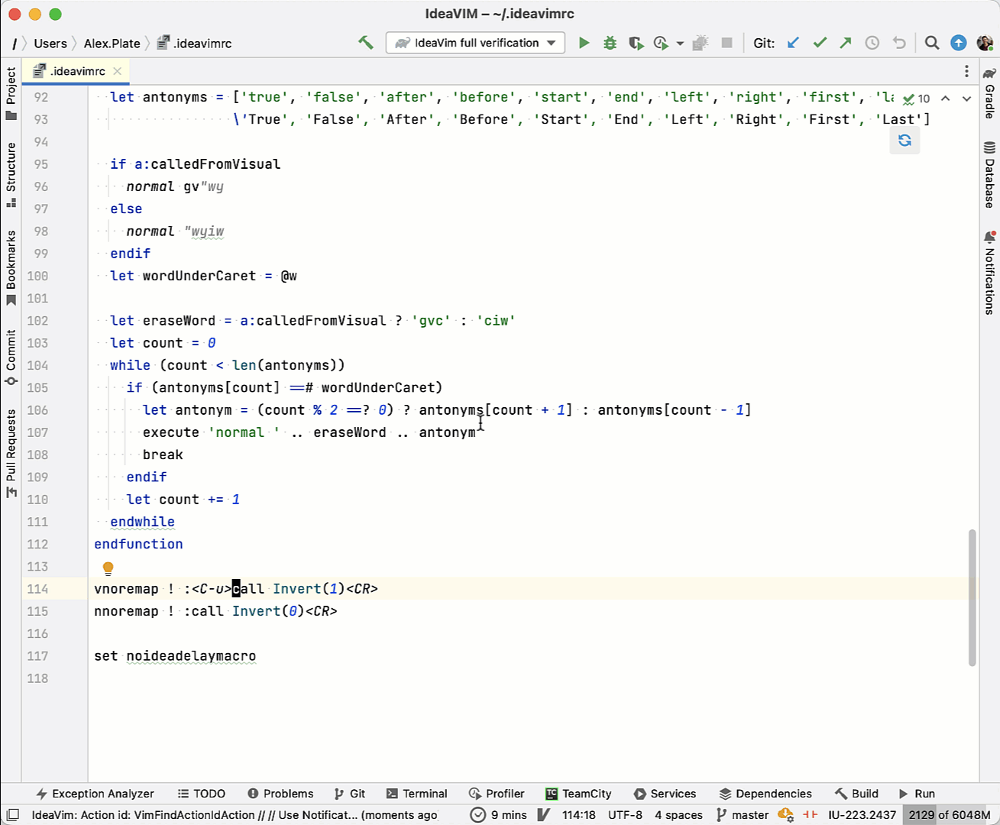

IdeaVim
===

[![Official JetBrains Project][jb-official-svg]][jb-official]
[![Contributions welcome][contributions-welcome-svg]][contributions-welcome]
[![Downloads][plugin-downloads-svg]][plugin-repo]
[![Rating][plugin-rating-svg]][plugin-repo]
[![Version][plugin-version-svg]][plugin-repo]
[![Gitter][gitter-svg]][gitter]
[](https://codecov.io/gh/JetBrains/ideavim)
[![Twitter][twitter-svg]][twitter]

IdeaVim is a Vim engine for JetBrains IDEs.

##### Contact maintainers:
* [Bug tracker](https://youtrack.jetbrains.com/issues/VIM)
* [@IdeaVim](https://twitter.com/ideavim) on Twitter
* [Chat on gitter](https://gitter.im/JetBrains/ideavim)
* [IdeaVim Channel](https://jb.gg/bi6zp7) on [JetBrains Server](https://discord.gg/jetbrains)

##### Resources:

* [Plugin homepage](https://lp.jetbrains.com/ideavim/)
* [Plugin on Marketplace](https://plugins.jetbrains.com/plugin/164-ideavim)
* [Changelog](CHANGES.md)
* [Continuous integration builds](https://ideavim.teamcity.com/)

#### Compatibility

IntelliJ IDEA, PyCharm, CLion, PhpStorm, WebStorm, RubyMine, DataGrip, GoLand, Rider, Cursive,
Android Studio and other [JetBrains IDEs](https://www.jetbrains.com/ides/).

Setup
------------

- IdeaVim can be installed via `Settings | Plugins`.
See the [detailed instructions](https://www.jetbrains.com/help/idea/managing-plugins.html#).

- Use `Tools | Vim` in the menu to enable or disable vim.

- Use the `~/.ideavimrc` file as an analog of `~/.vimrc` ([learn more](#Files)). The XDG standard is supported, as well.

- Shortcut conflicts can be resolved by using:
     - On Linux & Windows: `File | Settings | Editor | Vim` & `File | Settings | Keymap`,
     - On macOS: `Preferences | Editor | Vim` & `Preferences | Keymap`,
     - Regular Vim mappings in the  `~/.ideavimrc` file.

Get Early Access
-------------------

Would you like to try new features and fixes? Join the Early Access Program and
receive EAP builds as updates!  

1. Click the  IdeaVim icon 
in the status bar  | `Early Access Program` | `Subscribe to EAP`


Or subscribe to EAP updates manually:

1. Open `Settings | Plugins`
2. Click the gear icon :gear:, select `Manage Plugin Repositories`, and add the following url:
```
https://plugins.jetbrains.com/plugins/eap/ideavim
```

See [the changelog](CHANGES.md) for the list of unreleased features.

It is important to distinguish EAP builds from traditional pre-release software.
Please note that the quality of EAP versions may at times be way below even
usual beta standards.

You can always leave your feedback with:
* [@IdeaVim](https://twitter.com/ideavim) in Twitter
* [Bug tracker](https://youtrack.jetbrains.com/issues/VIM)


Summary of Supported Vim Features
---------------------------------

Here are some examples of supported vim features and commands:

* Normal / insert / visual / select / etc. modes
* Motion / deletion / change / window / etc. commands
* Key mappings
* Marks / Macros / Digraphs / Registers
* Some [set commands](https://github.com/JetBrains/ideavim/wiki/set-commands)
* Full Vim regexps for search and search/replace
* Vim web help
* `~/.ideavimrc` configuration file

[IdeaVim plugins](https://github.com/JetBrains/ideavim/wiki/IdeaVim-Plugins):

* argtextobj
* commentary
* easymotion
* exchange
* FunctionTextObj
* highlightedyank
* indent-object
* matchit.vim
* Mini.ai
* multiple-cursors
* NERDTree
* paragraph-motion
* Peekaboo
* quick-scope
* ReplaceWithRegister
* sneak
* surround
* Switch
* textobj-entire
* Which-Key

See also:

* [Top feature requests and bugs](https://youtrack.jetbrains.com/issues/VIM?q=%23Unresolved+sort+by%3A+votes)
* [Vimscript support roadmap](vimscript-info/VIMSCRIPT_ROADMAP.md)
* [List of supported in-build functions](vimscript-info/FUNCTIONS_INFO.MD)

Files
-----

* `~/.ideavimrc`
    * Your IdeaVim-specific Vim initialization commands
    
<details>
<summary><strong>Example</strong> (click to see)</summary>

```vim
""" Map leader to space ---------------------
let mapleader=" "

""" Plugins  --------------------------------
set surround
set multiple-cursors
set commentary
set argtextobj
set easymotion
set textobj-entire
set ReplaceWithRegister

""" Plugin settings -------------------------
let g:argtextobj_pairs="[:],(:),<:>"

""" Common settings -------------------------
set showmode
set so=5
set incsearch
set nu

""" Idea specific settings ------------------
set ideajoin
set ideastatusicon=gray
set idearefactormode=keep

""" Mappings --------------------------------
map <leader>f <Plug>(easymotion-s)
map <leader>e <Plug>(easymotion-f)

map <leader>d <Action>(Debug)
map <leader>r <Action>(RenameElement)
map <leader>c <Action>(Stop)
map <leader>z <Action>(ToggleDistractionFreeMode)

map <leader>s <Action>(SelectInProjectView)
map <leader>a <Action>(Annotate)
map <leader>h <Action>(Vcs.ShowTabbedFileHistory)
map <S-Space> <Action>(GotoNextError)

map <leader>b <Action>(ToggleLineBreakpoint)
map <leader>o <Action>(FileStructurePopup)
```
</details>

<details>
<summary><strong>Suggested options</strong> (click to see)</summary>

Here is also a list of the suggested options from [defaults.vim](https://github.com/vim/vim/blob/master/runtime/defaults.vim)

```vim
" Show a few lines of context around the cursor. Note that this makes the
" text scroll if you mouse-click near the start or end of the window.
set scrolloff=5

" Do incremental searching.
set incsearch

" Don't use Ex mode, use Q for formatting.
map Q gq
```
</details>


You can read your `~/.vimrc` file from `~/.ideavimrc` with this command:

    source ~/.vimrc

Also note that if you have overridden the `user.home` JVM option, this
will affect where IdeaVim looks for your `.ideavimrc` file. For example, if you
have `-Duser.home=/my/alternate/home` then IdeaVim will source
`/my/alternate/home/.ideavimrc` instead of `~/.ideavimrc`.

Alternatively, you can set up initialization commands using [XDG](https://specifications.freedesktop.org/basedir-spec/basedir-spec-latest.html) standard.
Put your settings to `$XDG_CONFIG_HOME/ideavim/ideavimrc` file.


IdeaVim Plugins
--------------------

See [doc/IdeaVim Plugins.md](https://github.com/JetBrains/ideavim/wiki/IdeaVim-Plugins)

Executing IDE Actions
---------------------

IdeaVim adds various commands for listing and executing arbitrary IDE actions as
Ex commands or via `:map` command mappings:

### Executing actions:
* `<Action>({action_id})`
    * For the mappings you can use a special `<Action>` keyword. Don't forget the parentheses.
    * E.g. `map gh <Action>(ShowErrorDescription)`  <- execute hover on `gh`.
    * :warning: Mappings to `<Action>` don't work with `noremap`. 
      If you know the case when it's needed, please [let us know](https://github.com/JetBrains/ideavim#contact-maintainers).
* `:action {action_id}`
    * Execute an action by `{action_id}`. Works from Ex command line.
    * Please don't use `:action` in mappings. Use `<Action>` instead.

### Finding action IDs:

* IJ provides `IdeaVim: track action IDs` command to show the id of the executed actions.
  This command can be found in "Search everywhere" (double `shift`).

    <details>
        <summary><strong>"Track action IDs" Details</strong> (click to see)</summary>
        <picture>
            <source media="(prefers-color-scheme: dark)" srcset="assets/readme/track_action_dark.gif">
            
        </picture>
    </details>


* `:actionlist [pattern]`
    * Find IDE actions by id or keymap pattern (E.g. `:actionlist extract`, `:actionlist <C-D`)

##### Examples:

```vim
" Map \r to the Reformat Code action
:map \r <Action>(ReformatCode)

" Map <leader>d to start debug
:map <leader>d <Action>(Debug)

" Map \b to toggle the breakpoint on the current line
:map \b <Action>(ToggleLineBreakpoint)
```

##### Some popular actions:

```
ShowHoverInfo - Quick Documentation and Error Description
QuickImplementations - Quick Definition
```

Vim Script
------------

IdeaVim can execute custom scripts that are written with Vim Script.
At the moment we support all language features, but not all of the built-in functions and options are supported.

Additionally, you may be interested in the
[Vim Script Discussion](https://github.com/JetBrains/ideavim/discussions/357) or
[Vim Script Roadmap](https://github.com/JetBrains/ideavim/blob/master/vimscript-info/VIMSCRIPT_ROADMAP.md).


### IDE specific options

You can evaluate the `has('ide')` function call and get `1` if it was called with IdeaVim or `0` if the function was called from Vim/NeoVim.  
The option `&ide` contains the name and edition of your IDE, for example, "IntelliJ IDEA Ultimate Edition".  
To see its value for the current IDE you are using, execute the `:echo &ide` command.  
To write an IDE-specific configuration, use Vim's regexp match operators `=~?` (case-insensitive) / `=~#`  (case-sensitive)

**Example config:**

```vim
" options and mappings that are supported by both Vim and IdeaVim
set nu
set relativenumber

if has('ide')
  " mappings and options that exist only in IdeaVim
  map <leader>f <Action>(GotoFile)
  map <leader>g <Action>(FindInPath)
  map <leader>b <Action>(Switcher)

  if &ide =~? 'intellij idea'
    if &ide =~? 'community'
      " some mappings and options for IntelliJ IDEA Community Edition
    elseif &ide =~? 'ultimate'
      " some mappings and options for IntelliJ IDEA Ultimate Edition
    endif
  elseif &ide =~? 'pycharm'
    " PyCharm specific mappings and options
  endif
else
  " some mappings for Vim/Neovim
  nnoremap <leader>f <cmd>Telescope find_files<cr>
endif
```

:gem: Contributing
------------

The power of contributing drives IdeaVim :muscle:. Even small contributions matter!

See the contribution guide in [CONTRIBUTING.md](CONTRIBUTING.md) to start bringing your value to the project.

😎 In 2025, we launched a rewards program. See the guide for details.

Authors
-------

See [AUTHORS.md](AUTHORS.md)
for a list of authors and contributors.

IdeaVim tips and tricks
-------

- Use the power of IJ and Vim:
    - `set ideajoin` to enable join via the IDE. See the [examples](https://jb.gg/f9zji9).
    - Make sure `ideaput` is enabled for `clipboard` to enable native IJ insertion in Vim.
    - Sync IJ bookmarks and IdeaVim global marks: `set ideamarks` (works for marks with capital letters only)
    - Check out more [ex commands](https://github.com/JetBrains/ideavim/wiki/set-commands).

- Use your vim settings with IdeaVim. Put `source ~/.vimrc` in `~/.ideavimrc`.
- Control the status bar icon via the [`ideastatusicon` option](https://github.com/JetBrains/ideavim/wiki/set-commands).
- Not familiar with the default behaviour during a refactoring? See the [`idearefactormode` option](https://github.com/JetBrains/ideavim/wiki/set-commands).

Some facts about Vim
-------

Let’s relax and have some fun now! Here are a few things we've found interesting during development
and would like to share with you.

- There are no such commands as `dd`, `yy`, or `cc`. For example, `dd` is not a separate command for deleting the line,
but a `d` command with a `d` motion.  
Wait, but there isn't a `d` motion in Vim! That’s right, and that’s why Vim has a dedicated set of commands
for which it checks whether the 
[command equals to motion](https://github.com/vim/vim/blob/759d81549c1340185f0d92524c563bb37697ea88/src/normal.c#L6468)
and if so, it executes `_` motion instead.  
`_` is an interesting motion that isn't even documented in vi, and it refers to the current line.
So, commands like `dd`, `yy`, and similar ones are simply translated to `d_`, `y_`, etc.
[Here](https://github.com/vim/vim/blob/759d81549c1340185f0d92524c563bb37697ea88/src/normal.c#L6502)
is the source of this knowledge.

- `x`, `D`, and `&` are not separate commands either. They are synonyms of `dl`, `d$`, and `:s\r`, respectively.
[Here](https://github.com/vim/vim/blob/759d81549c1340185f0d92524c563bb37697ea88/src/normal.c#L5365)
is the full list of synonyms.

- You can read a [post](https://github.com/JetBrains/ideavim/wiki/how-many-modes-does-vim-have) about how modes work in Vim and IdeaVim.

- Have you ever used `U` after `dd`? [Don't even try](https://github.com/vim/vim/blob/759d81549c1340185f0d92524c563bb37697ea88/src/ops.c#L874).

- A lot of variables that refer to visual mode start with two uppercase letters, e.g. `VIsual_active`. [Some examples](https://github.com/vim/vim/blob/master/src/normal.c#L17).
  As mentioned [here](https://vi.stackexchange.com/a/42885/12441), this was done this way to avoid the clash with X11.

- Other [strange things](https://github.com/vim/vim/blob/759d81549c1340185f0d92524c563bb37697ea88/src/ex_docmd.c#L1845) from vi:
    * ":3"       jumps to line 3
    * ":3|..."   prints line 3
    * ":|"       prints current line

- Vim script doesn't skip white space before comma. `F(a ,b)` => E475.

- Fancy constants for [undolevels](https://vimhelp.org/options.txt.html#%27undolevels%27):
  > The local value is set to -123456 when the global value is to be used.

- Vi (not Vim) is a POSIX standard, and [has a spec](https://pubs.opengroup.org/onlinepubs/9699919799/utilities/vi.html)! Vim is mostly POSIX compliant when Vi compatibility is selected with the `'compatible'` option, but there are still some differences that can be changed with `'copoptions'`. The spec is interesting because it documents the behaviour of different commands in a stricter style than the user documentation, describing the current line and column after the command, for example. [More details can be found by reading `:help posix`](https://vimhelp.org/vi_diff.txt.html#posix).

- The Vim documentation contains many easter eggs. We encounter them occasionally, but GitHub user mikesmithgh has compiled a substantial collection [here](https://github.com/mikesmithgh/vimpromptu).
  - In addition to `:call err_teapot()`, which returns `E418: I'm a teapot`, there is also `:call err_teapot(1)`, which returns `E503: Coffee is currently not available`. Naturally, this is also supported in IdeaVim.

- Insert mode has all `Ctrl` keys mapped, except `Ctrl-B`. In the documentation, it is marked as **"CTRL-B in Insert
  mode gone"**. Call `:h i_CTRL-B-gone` in Vim to read why `Ctrl-B` was removed.

License
-------

IdeaVim is licensed under the MIT license.

Third-party components and licenses are listed in [ThirdPartyLicenses.md](ThirdPartyLicenses.md).

All releases before 2.0.0 were licensed under terms of GPL-2.0 or later.
The last commit before switch to MIT is 05852b07c6090ad40fde7d3cafe0b074604f7ac5.
You can read more about the license change here: https://github.com/JetBrains/ideavim/discussions/543


<!-- Badges -->
[jb-official]: https://confluence.jetbrains.com/display/ALL/JetBrains+on+GitHub
[jb-official-svg]: https://jb.gg/badges/official.svg

[plugin-repo]: https://plugins.jetbrains.com/plugin/164-ideavim
[plugin-downloads-svg]: http://img.shields.io/jetbrains/plugin/d/IdeaVIM
[plugin-rating-svg]: http://img.shields.io/jetbrains/plugin/r/rating/IdeaVIM
[plugin-version-svg]: https://img.shields.io/jetbrains/plugin/v/ideavim?label=version

[gitter-svg]: https://badges.gitter.im/JetBrains/ideavim.svg
[gitter]: https://gitter.im/JetBrains/ideavim?utm_source=badge&utm_medium=badge&utm_campaign=pr-badge&utm_content=badge

[twitter]: https://twitter.com/ideavim
[twitter-svg]: https://img.shields.io/twitter/follow/ideavim?label=twitter%20%40ideavim

[contributions-welcome-svg]: http://img.shields.io/badge/contributions-welcome-brightgreen
[contributions-welcome]: https://github.com/JetBrains/ideavim/blob/master/CONTRIBUTING.md
