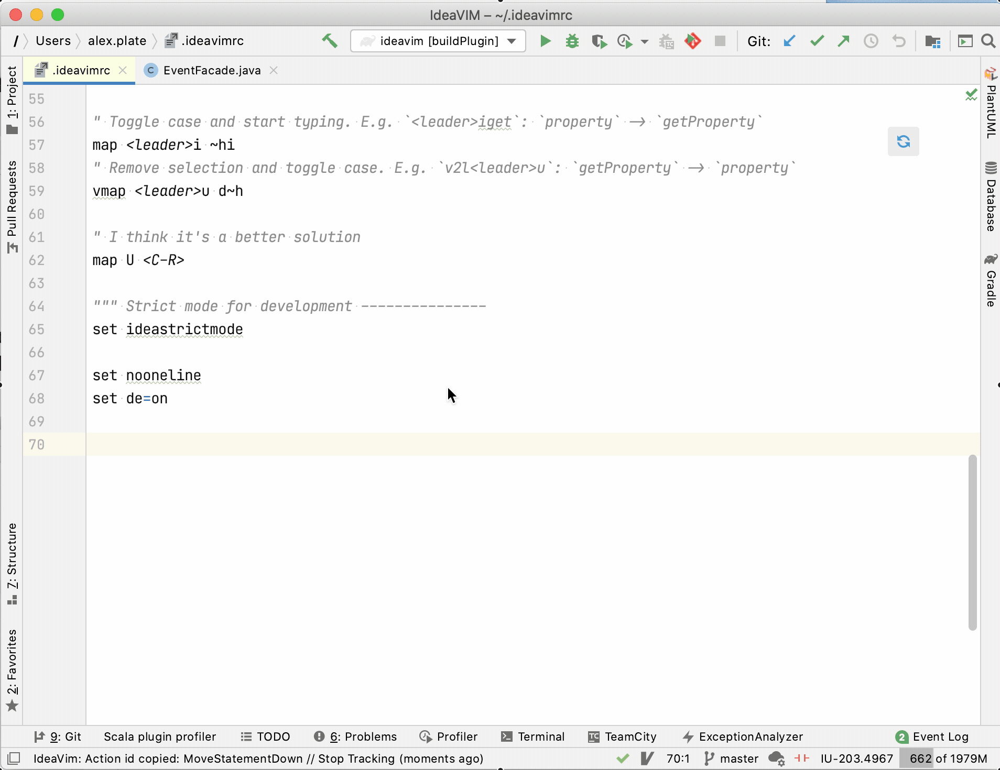

IdeaVim
===

[![Official JetBrains Project][jb-official-svg]][jb-official]
[![Contributions welcome][contributions-welcome-svg]][contributions-welcome]
[![Downloads][plugin-downloads-svg]][plugin-repo]
[![Rating][plugin-rating-svg]][plugin-repo]
[![Version][plugin-version-svg]][plugin-repo]
[![Gitter][gitter-svg]][gitter]
[![Twitter][twitter-svg]][twitter]

IdeaVim is a Vim emulation plugin for IntelliJ Platform-based IDEs.

##### Contact maintainers:
* [Bug tracker](https://youtrack.jetbrains.com/issues/VIM)
* [@IdeaVim](https://twitter.com/ideavim) on Twitter
* [Chat on gitter](https://gitter.im/JetBrains/ideavim)
* [Unofficial discord server](https://jb.gg/bi6zp7)

##### Resources:

* [Plugin homepage](https://plugins.jetbrains.com/plugin/164-ideavim)
* [Changelog](CHANGES.md)
* [Continuous integration builds](https://teamcity.jetbrains.com/project.html?projectId=IdeaVim&guest=1)

#### Compatibility

IntelliJ IDEA, PyCharm, CLion, PhpStorm, WebStorm, RubyMine, AppCode, DataGrip, GoLand, Rider, Cursive,
Android Studio and other IntelliJ platform based IDEs.

Setup
------------

- IdeaVim can be installed via `Settings | Plugins`.
See the [detailed instructions](https://www.jetbrains.com/help/idea/managing-plugins.html#).

- Use `Tools | Vim Emulator` to enable or disable emulation.

- Use the `~/.ideavimrc` file as an analog of `~/.vimrc` ([learn more](#Files)). The XDG standard is supported, as well.

- Shortcut conflicts can be resolved by using:
     - On Linux & Windows: `File | Settings | Editor | Vim Emulation` & `File | Settings | Keymap`,
     - On macOS: `Preferences | Editor | Vim Emulation` & `Preferences | Keymap`,
     - Regular Vim mappings in the  `~/.ideavimrc` file.

Get Early Access
-------------------

Would you like to try new features and fixes? Join the Early Access Program and
receive EAP builds as updates!  

1. Click the  IdeaVim icon 
in the status bar  | `EAP` | `Get Early Access...`


Or subscribe to EAP updates manually:

1. Open `Settings | Plugins`
2. Click the gear icon :gear:, select `Manage Plugin Repositories`, and add the following url:
 `https://plugins.jetbrains.com/plugins/eap/ideavim`

See [the changelog](CHANGES.md) for the list of unreleased features.

It is important to distinguish EAP builds from traditional pre-release software.
Please note that the quality of EAP versions may at times be way below even
usual beta standards.

You can always leave your feedback with:
* [@IdeaVim](https://twitter.com/ideavim) in Twitter
* [Bug tracker](https://youtrack.jetbrains.com/issues/VIM)


Summary of Supported Vim Features
---------------------------------

Here are some examples of supported vim features and commands:

* Normal / insert / visual / select / etc. modes
* Motion / deletion / change / window / etc. commands
* Key mappings
* Marks / Macros / Digraphs / Registers
* Some [set commands](https://github.com/JetBrains/ideavim/wiki/%22set%22-commands)
* Full Vim regexps for search and search/replace
* Vim web help
* `~/.ideavimrc` configuration file

[Emulated Vim plugins](https://github.com/JetBrains/ideavim/wiki/Emulated-plugins):

* vim-easymotion
* vim-surround
* vim-multiple-cursors
* vim-commentary
* argtextobj.vim
* vim-textobj-entire
* ReplaceWithRegister
* vim-exchange
* vim-highlightedyank

See also:

* [The list of all supported commands](src/com/maddyhome/idea/vim/package-info.java)
* [Top feature requests and bugs](https://youtrack.jetbrains.com/issues/VIM?q=%23Unresolved+sort+by%3A+votes)


Files
-----

* `~/.ideavimrc`
    * Your IdeaVim-specific Vim initialization commands
    
<details>
<summary><strong>Example</strong> (click to see)</summary>

```vim
""" Map leader to space ---------------------
let mapleader=" "

""" Plugins  --------------------------------
set surround
set multiple-cursors
set commentary
set argtextobj
set easymotion
set textobj-entire
set ReplaceWithRegister

""" Plugin settings -------------------------
let g:argtextobj_pairs="[:],(:),<:>"

""" Common settings -------------------------
set showmode
set so=5
set incsearch
set nu

""" Idea specific settings ------------------
set ideajoin
set ideastatusicon=gray
set idearefactormode=keep

""" Mappings --------------------------------
map <leader>f <Plug>(easymotion-s)
map <leader>e <Plug>(easymotion-f)

map <leader>d <Action>(Debug)
map <leader>r <Action>(RenameElement)
map <leader>c <Action>(Stop)
map <leader>z <Action>(ToggleDistractionFreeMode)

map <leader>s <Action>(SelectInProjectView)
map <leader>a <Action>(Annotate)
map <leader>h <Action>(Vcs.ShowTabbedFileHistory)
map <S-Space> <Action>(GotoNextError)

map <leader>b <Action>(ToggleLineBreakpoint)
map <leader>o <Action>(FileStructurePopup)
```
</details>

<details>
<summary><strong>Suggested options</strong> (click to see)</summary>

Here is also a list of the suggested options from [defaults.vim](https://github.com/vim/vim/blob/master/runtime/defaults.vim)

```vim
" Show a few lines of context around the cursor.  Note that this makes the
" text scroll if you mouse-click near the start or end of the window.
set scrolloff=5

" Do incremental searching
set incsearch

" Don't use Ex mode, use Q for formatting.
map Q gq
```
</details>


You can read your `~/.vimrc` file from `~/.ideavimrc` with this command:

    source ~/.vimrc

> :warning: Please note that IdeaVim currently parses `~/.ideavimrc` & `~/.vimrc` files via simple pattern-matching.
See [VIM-669](https://youtrack.jetbrains.com/issue/VIM-669) for proper parsing
of VimL files.

Also note that if you have overridden the `user.home` JVM option, this
will affect where IdeaVim looks for your `.ideavimrc` file. For example, if you
have `-Duser.home=/my/alternate/home` then IdeaVim will source
`/my/alternate/home/.ideavimrc` instead of `~/.ideavimrc`.

Alternatively, you can set up initialization commands using [XDG](https://specifications.freedesktop.org/basedir-spec/basedir-spec-latest.html) standard.
Put your settings to `$XDG_CONFIG_HOME/ideavim/ideavimrc` file.


Emulated Vim Plugins
--------------------

See [doc/emulated-plugins.md](https://github.com/JetBrains/ideavim/wiki/Emulated-plugins)

Executing IDE Actions
---------------------

IdeaVim adds various commands for listing and executing arbitrary IDE actions as
Ex commands or via `:map` command mappings:

**Executing actions:**
* `:action {action_id}`
    * Execute an action by id. Works from Ex command line.
* `<Action>(*action_id*)`
    * For the mappings you can use a special `<Action>` keyword. Don't forget the parentheses.

**Finding actions:**
* `:actionlist [pattern]`
    * Find IDE actions by id or keymap pattern (E.g. `:actionlist extract`, `:actionlist <C-D`)
    
* In addition to `:actionlist` command, IdeaVim provides `IdeaVim: track action Ids` option to 
extract the ids of executed command. This option can be found in "Search everywhere" (double `shift`).

    <details>
        <summary><strong>"Track action Ids" Details</strong> (click to see)</summary>
        
    </details>

Examples:

```vim
" Map \r to the Reformat Code action
:map \r <Action>(ReformatCode)

" Map <leader>d to start debug
:map <leader>d <Action>(Debug)

" Map \b to toggle the breakpoint on the current line
:map \b <Action>(ToggleLineBreakpoint)
```

:gem: Contributing
------------

The power of contributing drives IdeaVim :muscle:. Even small contributions matter!

See [CONTRIBUTING.md](CONTRIBUTING.md) to start bringing your value to the project.

Authors
-------

See [AUTHORS.md](AUTHORS.md)
for a list of authors and contributors.

IdeaVim tips and tricks
-------

- Use the power of IJ and Vim:
    - `set ideajoin` to enable join via the IDE. See the [examples](https://jb.gg/f9zji9).
    - Make sure `ideaput` is enabled for `clipboard` to enable native IJ insertion in Vim.
    - Sync IJ bookmarks and Vim marks: `set ideamarks`
    - Check out more [ex commands](https://github.com/JetBrains/ideavim/wiki/%22set%22-commands).

- Use your vim settings with IdeaVim. Put `source ~/.vimrc` in `~/.ideavimrc`.
    > :warning: Please note that IdeaVim currently parses `~/.ideavimrc` & `~/.vimrc` files via simple pattern-matching.
    See [VIM-669](https://youtrack.jetbrains.com/issue/VIM-669) for proper parsing
    of VimL files.

- Control the status bar icon via the [`ideastatusicon` option](https://github.com/JetBrains/ideavim/wiki/%22set%22-commands).
- Not familiar with the default behaviour during a refactoring? See the [`idearefactormode` option](https://github.com/JetBrains/ideavim/wiki/%22set%22-commands).

Some facts about Vim
-------

Let’s relax and have some fun now! Here are a few things we've found interesting during development
and would like to share with you.

- There are no such commands as `dd`, `yy`, or `cc`. For example, `dd` is not a separate command for deleting the line,
but a `d` command with a `d` motion.  
Wait, but there isn't a `d` motion in Vim! That’s right, and that’s why Vim has a dedicated set of commands
for which it checks whether the 
[command equals to motion](https://github.com/vim/vim/blob/759d81549c1340185f0d92524c563bb37697ea88/src/normal.c#L6468)
and if so, it executes `_` motion instead.  
`_` is an interesting motion that isn't even documented in vi, and it refers to the current line.
So, commands like `dd`, `yy`, and similar ones are simply translated to `d_`, `y_`, etc.
[Here](https://github.com/vim/vim/blob/759d81549c1340185f0d92524c563bb37697ea88/src/normal.c#L6502)
is the source of this knowledge.

- `x`, `D`, and `&` are not separate commands either. They are synonyms of `dl`, `d$`, and `:s\r`, respectively.
[Here](https://github.com/vim/vim/blob/759d81549c1340185f0d92524c563bb37697ea88/src/normal.c#L5365)
is the full list of synonyms.

- Have you ever used `U` after `dd`? [Don't even try](https://github.com/vim/vim/blob/759d81549c1340185f0d92524c563bb37697ea88/src/ops.c#L874).

- A lot of variables that refers to visual mode start with two uppercase letters, e.g. `VIsual_active`. [Some examples](https://github.com/vim/vim/blob/master/src/normal.c#L17).

- Other [strange things](https://github.com/vim/vim/blob/759d81549c1340185f0d92524c563bb37697ea88/src/ex_docmd.c#L1845) from vi:
    * ":3"       jumps to line 3
    * ":3|..."   prints line 3
    * ":|"       prints current line

- Vim script doesn't skip white space before comma. `F(a ,b)` => E475.

License
-------

IdeaVim is licensed under the terms of the GNU Public License version 2
or any later version.


<!-- Badges -->
[jb-official]: https://confluence.jetbrains.com/display/ALL/JetBrains+on+GitHub
[jb-official-svg]: https://jb.gg/badges/official.svg

[plugin-repo]: https://plugins.jetbrains.com/plugin/164-ideavim
[plugin-downloads-svg]: http://img.shields.io/jetbrains/plugin/d/IdeaVIM
[plugin-rating-svg]: http://img.shields.io/jetbrains/plugin/r/rating/IdeaVIM
[plugin-version-svg]: https://img.shields.io/jetbrains/plugin/v/ideavim?label=version

[gitter-svg]: https://badges.gitter.im/JetBrains/ideavim.svg
[gitter]: https://gitter.im/JetBrains/ideavim?utm_source=badge&utm_medium=badge&utm_campaign=pr-badge&utm_content=badge

[twitter]: https://twitter.com/ideavim
[twitter-svg]: https://img.shields.io/twitter/follow/ideavim?label=twitter%20%40ideavim

[contributions-welcome-svg]: http://img.shields.io/badge/contributions-welcome-brightgreen
[contributions-welcome]: https://github.com/JetBrains/ideavim/blob/master/CONTRIBUTING.md
