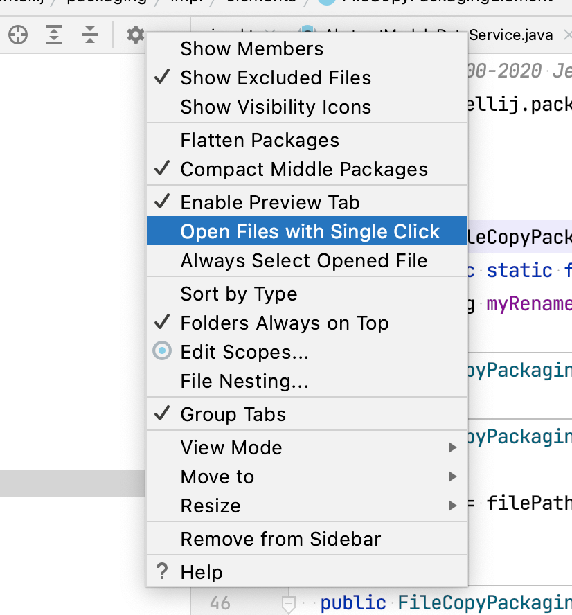

# NERDTree

IdeaVim supports the NERDTree plugin. Update your `~/.ideavimrc` to turn it on:
```vim
Plug 'preservim/nerdtree'
```
or
```vim
set NERDTree
```
Use `set noNERDTree` to disable this extension.

<details>
<summary>Full list of aliases</summary>

```vim
set NERDTree
Plug 'preservim/nerdtree'
Plug 'https://github.com/preservim/nerdtree'
Plug 'https://github.com/scrooloose/nerdtree'
Plug 'scrooloose/nerdtree'
Plug 'nerdtree'
```
</details>


### Preview

<details>
<summary>Click for the preview</summary>

</details>

### Supported commands

- `:NERDTree`
- `:NERDTreeFocus`
- `:NERDTreeToggle`
- `:NERDTreeClose`
- `:NERDTreeFind`
- `:NERDTreeRefreshRoot`

| Key     | Description                                            | Map Setting                    |
|---------|--------------------------------------------------------|--------------------------------|
| `o`     | Open files, directories and bookmarks                  | `g:NERDTreeMapActivateNode`    |
| `go`    | Open selected file, but leave cursor in the NERDTree   | `g:NERDTreeMapPreview`         |
| `t`     | Open selected node/bookmark in a new tab               | `g:NERDTreeMapOpenInTab`       |
| `T`     | Same as 't' but keep the focus on the current tab      | `g:NERDTreeMapOpenInTabSilent` |
| `i`     | Open selected file in a split window                   | `g:NERDTreeMapOpenSplit`       |
| `gi`    | Same as i, but leave the cursor on the NERDTree        | `g:NERDTreeMapPreviewSplit`    |
| `s`     | Open selected file in a new vsplit                     | `g:NERDTreeMapOpenVSplit`      |
| `gs`    | Same as s, but leave the cursor on the NERDTree        | `g:NERDTreeMapPreviewVSplit`   |
| `O`     | Recursively open the selected directory                | `g:NERDTreeMapOpenRecursively` |
| `x`     | Close the current nodes parent                         | `g:NERDTreeMapCloseDir`        |
| `X`     | Recursively close all children of the current node     | `g:NERDTreeMapCloseChildren`   |
| `P`     | Jump to the root node                                  | `g:NERDTreeMapJumpRoot`        |
| `p`     | Jump to current nodes parent                           | `g:NERDTreeMapJumpParent`      | 
| `K`     | Jump up inside directories at the current tree depth   | `g:NERDTreeMapJumpFirstChild`  |
| `J`     | Jump down inside directories at the current tree depth | `g:NERDTreeMapJumpLastChild`   |
| `<C-J>` | Jump down to next sibling of the current directory     | `g:NERDTreeMapJumpNextSibling` |
| `<C-K>` | Jump up to previous sibling of the current directory   | `g:NERDTreeMapJumpPrevSibling` |
| `r`     | Recursively refresh the current directory              | `g:NERDTreeMapRefresh`         |
| `R`     | Recursively refresh the current root                   | `g:NERDTreeMapRefreshRoot`     |
| `m`     | Display the NERDTree menu                              | `g:NERDTreeMapMenu`            |
| `q`     | Close the NERDTree window                              | `g:NERDTreeMapQuit`            |
| `A`     | Zoom (maximize/minimize) the NERDTree window           | `g:NERDTreeMapToggleZoom`      |
| `d`     | Delete file or directory                               | `g:NERDTreeMapDelete`          |
| `n`     | Create File                                            | `g:NERDTreeMapNewFile`         |
| `N`     | Create Directory                                       | `g:NERDTreeMapNewDir`          |

### Troubleshooting

If you see the the file is opened automatically on every movement in the Project View (`j`, `k`, etc.)
please make sure that you have "Open Files with Single click" disabled.


