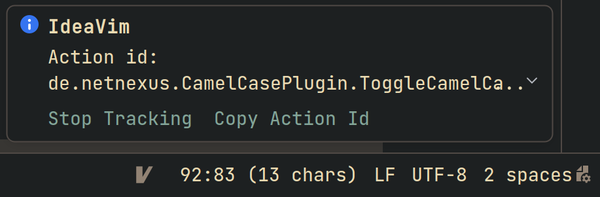

Using actions from external plugins is the same, as tracking and reusing any IDE action. As an example, let's create a mapping that will toggle case of the word under caret using the CamelCase plugin when you press `<leader>t`.

**Steps to make this mapping**

1. Install the plugin via Marketplace
2. Enable action tracking. You can enable it by one of the following ways:
    * Execute `:set trackactionids` ex command or just `:set tai`
    * Open the "Find actions" window by pressing `Ctrl-Shift-A` and search for "Track Action IDs" to find the toggle that enables and disables action tracking
3. Execute the plugin action the way intended by plugin author "See Edit menu or use ⇧ + ⌥ + U / Shift + Alt + U" or just find the `Toggle Camel Case` action in the "Find actions" window (`Ctrl-Shift-A`). If you action tracking is on, you will see this notification in your right bottom corner:
   
   
4. Copy the action id from the notification to create the following mapping in your .ideavimrc
```map <leader>t <Action>(de.netnexus.CamelCasePlugin.ToggleCamelCase)```
