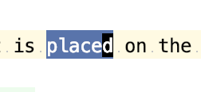
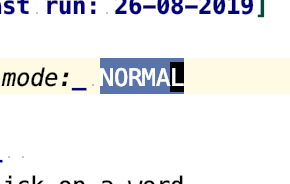
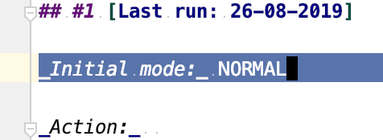
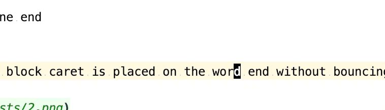
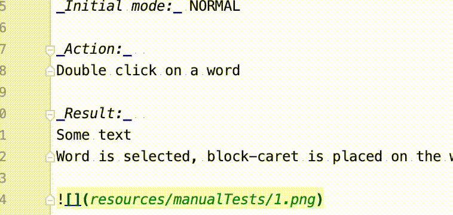
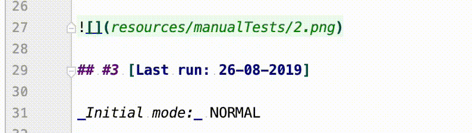
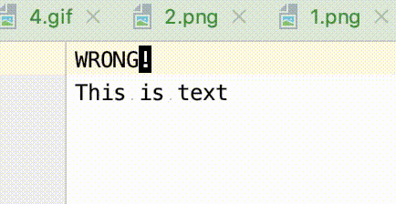
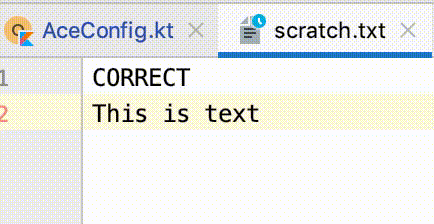
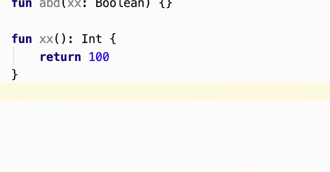

# Manual Tests

## #1 [Last run: 20-11-2019]

_Initial mode:_ NORMAL

_Action:_  
Double click on a word

_Result:_  
Some text
Word is selected, block-caret is placed on the word end (offset = `word end - 1`)

## #2 [Last run: 20-11-2019]

_Initial mode:_ NORMAL

_Action:_  
Double click on the line end

_Result:_  
Last word is selected, block caret is placed on the word end without bouncing

## #3 [Last run: 20-11-2019]

_Initial mode:_ NORMAL

_Action:_  
Triple click on the line end

_Result:_  
Line is selected. Caret is placed on the line end

## #4 [Last run: 20-11-2019]

_Initial mode:_ NORMAL

_Action:_  
Select with mouse dragging

_Result:_  
During the mouse drag caret becomes tiny shape.
After mouse release, caret moves one character back and becomes block shape

## #5 [Last run: 20-11-2019]

_Initial mode:_ NORMAL

_Action:_  
Select using gutter

_Result:_  
Perform selection using the editor gutter
During the mouse drag caret becomes tiny shape.
After mouse release, caret moves one character back and becomes block shape

## #6 [Last run: 20-11-2019]

_Initial mode:_ NORMAL

_Action:_  
Click on line number

_Result:_  
Line is selected, caret is on the first position

## #6 [Last run: 20-11-2019]

_Initial mode:_ NORMAL

_Action:_  
Select zero characters with mouse

__Wrong Result:__  
Caret stays in _tiny_ shape with a normal mode

_Result:_  
Caret stays in _block_ shape with a normal mode

## #7 [Last run: 20-11-2019]

_Action:_  
Turn emulation off and on

_Result:_  
Vim emulator works as expected

## #8 [Last run: 20-11-2019]

_Action:_  
Start up IJ with disabled emulator, turn it on

_Result:_  
Vim emulator works as expected

## #9 [Last run: 20-11-2019]

_Action:_  
Wrap with if

_Result:_  
Expression is wrapped, vim in insert mode.

